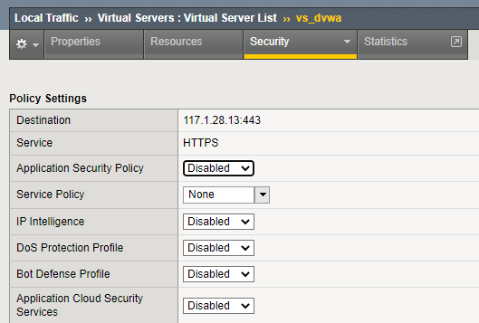

# Các cách thức bypass chức năng WAF
Trong quá trình áp dụng các chính sách, luật bảo vệ, có thể có lúc cần phải bypass tạm thời việc này, ví dụ để troubleshoot dễ dàng hơn. Có 2 cách thực hiện trên thiết bị F5 BIG-IP

**Chuyển qua lại chế độ Blocking và Transparent**

Truy cập vào `Security` > `Application Security` > `Security Policies` > `Policies List` (chọn đúng tên policy đang cần tác động).

Tại mục Enforcement Mode, chọn Transparent. Sau đó bấm nút `Save` và `Apply Policy`. Ở chế độ Transparent, hệ thống vẫn kiểm tra các truy cập, tuy nhiên sẽ không chặn ngay cả khi có vi phạm, có thể log lại các vi phạm này để người quản trị xem lại, phân tích.

**Chuyển qua lại chế độ bypass tính năng WAF**

Vào menu `Local Traffic` > `Virtual Servers` > bấm vào `Virtual Server List`. 
Sau đó, click chọn virtual server đang cần bypass. Tại màn hình tiếp theo, chọn Tab `Security` > `Policies`.
Phần `Application Security Policy`, chọn `Disabled`.

 

Với cách này, hệ thống F5 BIG-IP chỉ hoạt động đơn thuần như một thiết bị cân bằng tải hoặc reverse proxy, không có bất cứ một request nào được kiểm tra về mặt bảo mật. Mọi vi phạm cũng không được xem xét hay ghi log lại.
