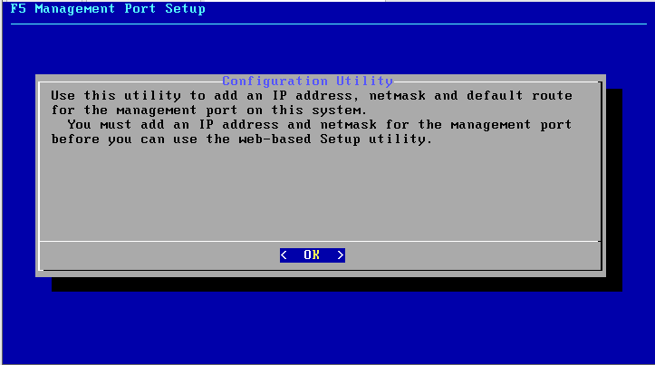

# Khởi tạo F5 BIG-IP instance trên VMWare Workstation

Tài liệu này mô tả ngắn gọn quá trình khởi tạo một máy ảo F5 BIG-IP trên nền VMWare Workstation, phiên bản 15.1.8.2 (download tại https://downloads.f5.com/)

## Import image

Trong VMWare Workstation, chọn Open file OVA đã download:


Chọn thư mục lưu các file cấu hình, đĩa cứng ảo:


Chọn cấu hình phần cứng sẽ cấp cho máy ảo (ví dụ 8vCPU-16GB RAM)


Mở rộng đĩa cứng ảo nếu cần (ví dụ mở rộng lên 150G)


Kiểm tra lại các thiết lập về giao diện mạng. Trong ví dụ này, các thiết lập gồm 3 NIC:
- NIC dành cho quản trị (management) để ở chế độ bridge với NIC vật lý
- NIC 2 để xử lý kết nối từ client (public) để ở chế độ NAT
- NIC 3 để kết nối tới server backend (private) để ở chế độ Host-only


Sau khi quá trình Import hoàn tất, máy ảo sẽ khởi động, màn hình boot tương tự như hình minh họa dưới đây (máy ảo có thể khởi động lại 1 lần trong lần boot đầu tiên)


Trong lần đăng nhập đầu tiên vào console, sử dụng user `root` và mật khẩu là `default`. 

Hệ thống sẽ yêu cầu đổi mật khẩu, hãy nhập lại mật khẩu `default`, sau đó nhập 2 lần `mật khẩu mới`. Hệ thống cũng thông báo rằng tài quản quản trị `admin` cũng sẽ sử dụng `mật khẩu mới` này cho lần đăng nhập đầu tiên qua giao diện quản trị web.


Tiếp theo, cấu hình địa chỉ IP và default gateway cho phần management network, gõ lệnh `config`:



Chọn IPv4


Nếu mạng vật lý có máy chủ DHCP, F5 BIG-IP sẽ được cấp tự động một địa chỉ và hệ thống sẽ hỏi nếu người quản trị muốn sử dụng địa chỉ này như hình minh họa bên dưới. Nếu đồng ý chọn `Yes`, nếu không, muốn thay đổi địa chỉ này, chọn `No` 


Nếu chọn `No` ở bước trên, tại đây nhập vào địa chỉ IPv4, Subnet Mask, Default Gateway..


Xác nhận lại các thông tin đã nhập như màn hình minh họa bên dưới:


Đợi một lát cho quá trình thiết lập địa chỉ IP quản trị mới này thành công. Người quản trị sau đó có thể truy cập vào giao diện SSH hoặc giao diện HTTPS của địa chỉ này để tiếp tục cấu hình.

Ví dụ, nếu dùng trình duyệt truy cập vào địa chỉ IP quản trị (https://<địa chỉ IP quản trị>), tài khoản đăng nhập là `admin`, mật khẩu trùng với mật khẩu root đã thay đổi ở bước trên. Hệ thống sẽ yêu cầu đổi mật khẩu cho tài khoản `admin`:


Nếu truy cập qua giao diện CLI sử dụng giao thức SSH hãy sử dụng tài khoản root. 

## Cấu hình cơ bản F5 BIG-IP

Các bước dưới đây là các lệnh cần thiết để thiết lập cấu hình cơ bản cho F5 BIG-IP qua giao diện SSH:

Cho phép tài khoản admin có thể dùng SSH
```
tmsh modify auth user admin shell bash
```

Tùy chọn: không cho sử dụng tài khoản root để đăng nhập để hạn chế các rủi ro về bảo mật hoặc tuân thủ với chính sách bảo mật nếu có
```
tmsh modify /sys db systemauth.disablerootlogin value true
```

Các cấu hình cần thiết khác:
```
tmsh modify sys global-settings gui-setup disabled
tmsh modify /sys http auth-pam-validate-ip off
tmsh modify /sys ntp timezone Asia/Saigon
tmsh modify /sys dns name-servers add { 8.8.8.8 1.1.1.1}
```
Tạo VLAN, đặt địa chỉ Self IP cho máy ảo F5 BIG-IP
```
tmsh create net vlan private_vlan interfaces add { 1.2 { untagged } }
tmsh create net self private_ip address 192.168.5.10/24 vlan private_vlan

tmsh create net vlan public_vlan interfaces add { 1.1 { untagged } }
tmsh create net self public_ip address 192.168.71.10/24 vlan public_vlan
```
Cấu hình default gateway
```
tmsh create net route default gw 192.168.71.2
```

Lưu cấu hình:
```
tmsh save sys config
```

Kích hoạt license:
```
SOAPLicenseClient --basekey YUKRH-ACFZR-JGNKZ-CDQWB-TCVVSLH
```

Bật tắt các module phần mềm, ví dụ tắt module LTM
```
tmsh modify sys provision ltm level none
```

Bật module ASM (tính năng WAF)
```
tmsh modify sys provision asm level nominal
```

Lưu cấu hình:
```
tmsh save sys config
```

Như vậy, máy ảo F5 BIG-IP đã được cấu hình cơ bản. Bước tiếp theo là cấu hình các dịch vụ cho nó.

