# Các tinh chỉnh, tính năng bảo mật khác

## 1. Thiết lập các signatures, signatureSet

Phần này mặc định rằng người quản trị đã cấu hình một chính sách bảo mật để bảo vệ ứng dụng web, tuy nhiên trong quá trình hoạt động thấy cần thiết phải thay đổi các dấu hiệu tấn công (attack signature). Ở đây:
- Signature (hay viết đầy đủ là attack signature): là một nhận dạng về dấu hiệu tấn công cụ thể. Hệ thống F5 BIG-IP có một cơ sở dữ liệu về các dấu hiệu tấn công như vậy và thường xuyên được cập nhật. Nếu trong quá trình kiểm tra HTTP request hoặc HTTP response, dữ liệu phù hợp với quy luật nhận dạng như vậy có thể sẽ bị coi là vi phạm chính sách bảo mật khi signature đó được áp dụng.
- SignatureSet là một tập hợp các signature, được nhóm theo một thể loại nào đó.

Để xem các signature đang được áp dụng đối với một policy, truy cấp vào `Security` > `Application Security` > `Security Policies` > `Policies List`, chọn policy cần xem. Sau đó bấm vào mục `Attack Signatures` 

Ví dụ:

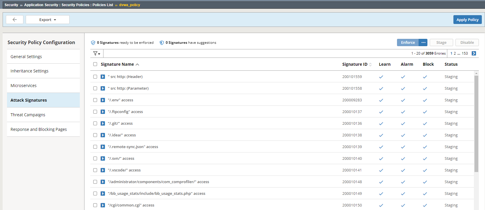 

Với mỗi signature, bấm vào biểu tượng mũi tên sẽ cho biết thông tin chi tiết, ví dụ:

 

Trong đó, lưu ý một số thông tin sau:

- Signature name: tên gọi của signature, phần nào đoán được nó là gì
- Signature ID: mã định danh của signature, sử dụng để tìm kiếm, mã định danh này là duy nhất đối với F5
- Learn: tạo ra các gợi ý cho người quản trị về việc có nên áp dụng signature này không dựa vào lưu lượng thực tế (Learning Suggestion)
- Alarm: tạo cảnh báo nếu có vi phạm
- Block: chặn tấn công nếu có vi phạm
- Staging: để ở chế độ giám sát, chưa chặn
- Enforce: thực hiện chặn vi phạm

Chế độ Signature Staging giúp hạn chế việc chặn nhầm vì nó chỉ tạo cảnh báo, giúp người quản trị có thời gian xem xét.

Ví dụ, việc truy cập vào một URI dạng phpinfo.php trong khi signature ID: 200010015 đang được bật, sẽ tạo ra một cảnh báo trong Events Log như sau:

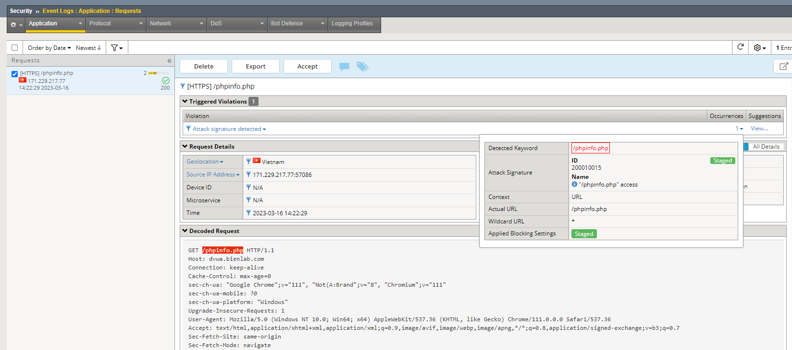 

Trong đó nêu rõ các thông tin về vi phạm này, động thời cũng chỉ ra rằng Signature này đang ở chế độ Staging (Staged), nên vi phạm vẫn được bỏ qua trên thực tế (thể hiện bằng mã 200 trả về từ máy chủ).

Nếu người quản trị cho rằng signature này cần phải chặn ngay lập tức, có thể vào mục `Attack Signatures` của policy tương ứng, tìm signature có ID đang cần thay đổi (trường hợp này là 200010015):

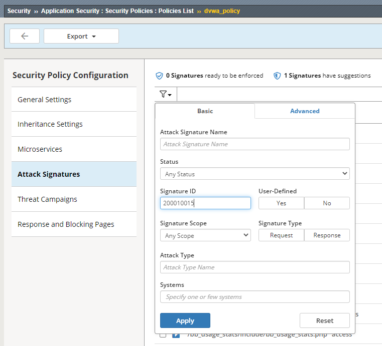

Chọn signature đó và bấm vào nút `Enforce`:

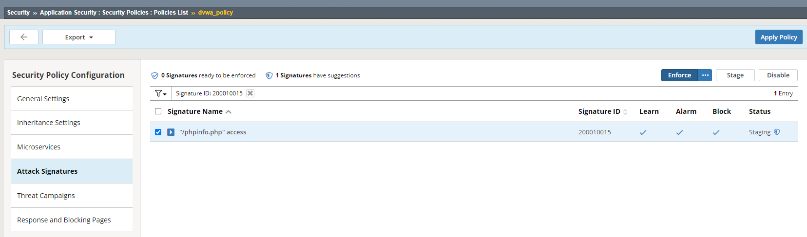

Sau đó xác nhận lại ở hộp thoại tiếp theo và bấm vào nút `Apply Policy`. Sau bước này, signature đó đã chuyển sang chế độ chặn trên thực tế (`Enforced`).

Người quản trị nên kiểm thử lại để xem kết quả

Truy cập sẽ bị chặn, với một thông báo tương tự như sau tại phía người dùng:

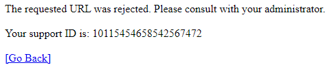

trong Events Log như sau:

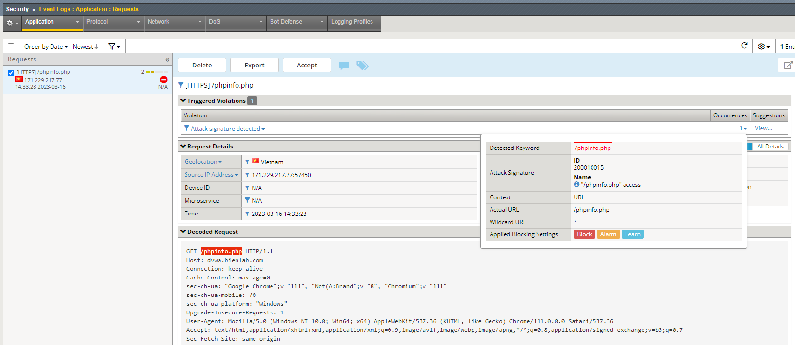

> Lưu ý: trong phần log trên, `Applied Blocking Settings` đã là `Block` `Alarm` `Learn`, đồng thời không có mã trả về từ server nữa mà thay vào đó là N/A và một cái biển cấm mầu đỏ.

Ngược lại, nếu biết chắc rằng signature đó là chặn nhầm, cần phải cho phép người dùng truy cập mà không chặn hay cảnh báo gì cả, người quản trị có thể tắt signature đó đi (Disable), truy cập vào phần `Attack Signature`, chọn signature đó và bấm vào nút `Disable`, sau đó `Apply Policy`

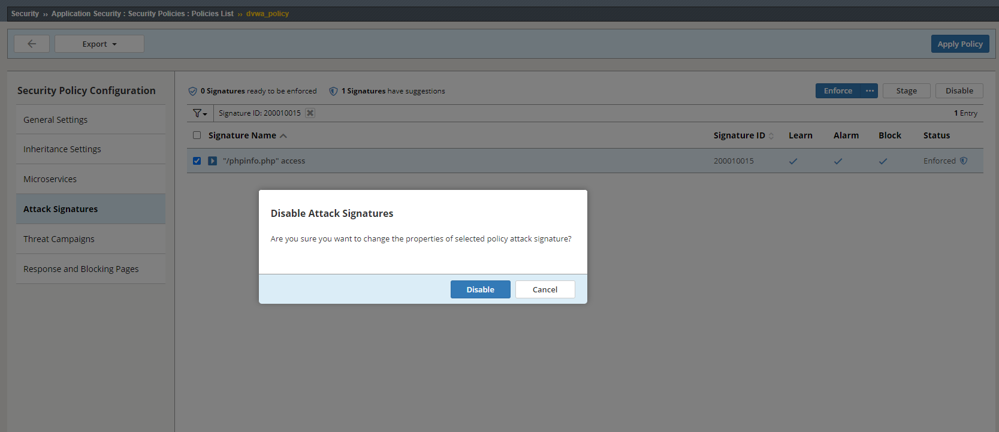

Sau khi disable, cũng nên kiểm tra lại xem truy cập đã bình thường chưa, có log vi phạm gì không.

Với SignatureSet, thay vì thực hiện theo từng signature cụ thể như trên (có hàng nghìn signature như vậy), người quản trị có thể bật tắt theo nhóm. 

Truy cập vào `Security` > `Application Security` > `Policy Building` > `Learning and Blocking Settings`, chọn policy tương ứng, mở rộng mục `Attack Signatures`:

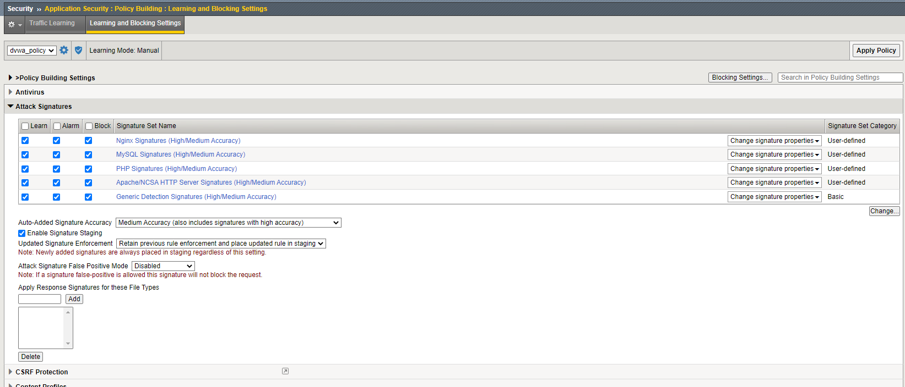

Nếu muốn thêm bớt các SignatureSet, bấm vào nút `Change`

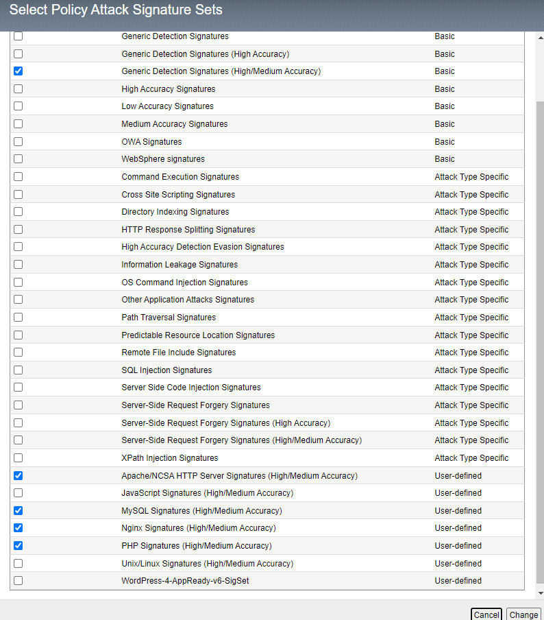

> Lưu ý: cần bấm vào nút `Save` bên dưới và sau đó bấm vào nút `Apply Policy` bên trên để thay đổi có hiệu lực ngay.

## 2. Thiết lập chế độ chặn dựa vào địa chỉ IP theo khu vực địa lý

Trong một số trường hợp, người quản trị muốn cho phép hoặc ngăn chặn các truy cập đến từ một khu vực địa lý cụ thể nào đó. Để làm điều này, truy cập vào `Security` > `Application Security` > `Geolocation Enforcement`. Ví dụ dưới đây là chặn truy cập từ Đài Loan:


> Lưu ý: bấm `Save` và `Apply Policy` để thiết lập có hiệu lực ngay.

Kiểm tra trong Event Log:

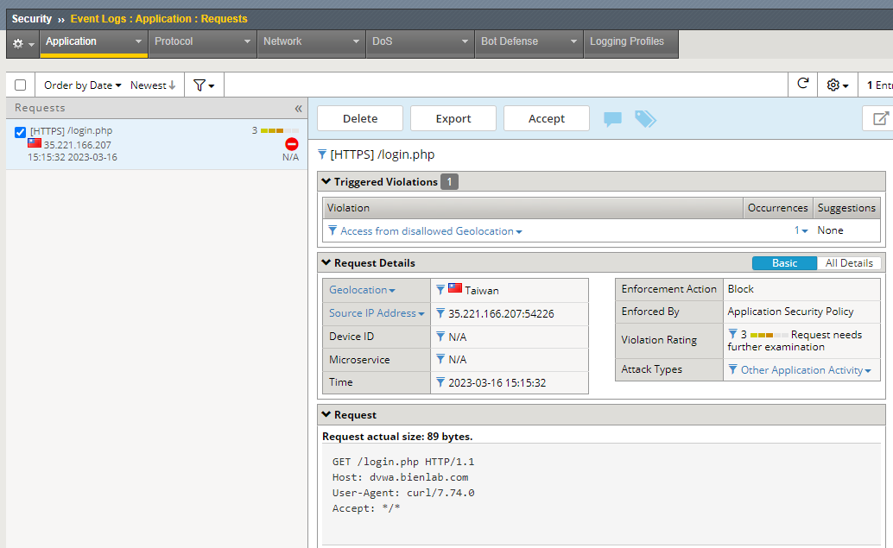

Một thiết lập như bên dưới đây sẽ chỉ cho phép truy cập từ Việt Nam:

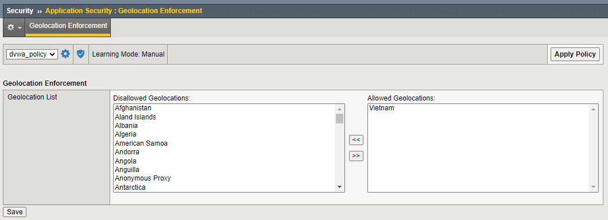

## 3. Thiết lập chế độ chặn dựa vào địa chỉ IP độc hại

Để thực hiện được tính năng này, cần đăng ký dịch vụ `IP Intelligent`, cách làm như sau:

Vào mục `Security` > `Network Firewall` > `IP Intelligence` > `Policies`. Bấm vào nút `Create` để tạo mới policy

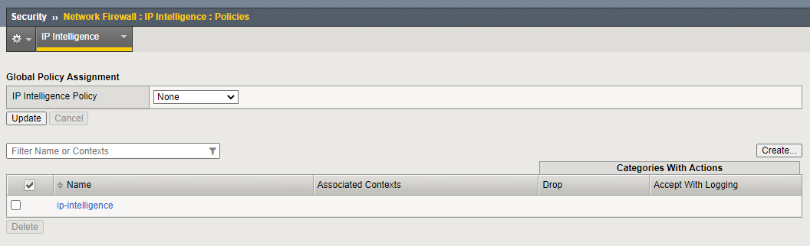

Thực hiện:
- Đặt tên cho policy
- Thiết lập Default Action: hành động mặc định, ví dụ Drop
- Thiết lập Default Log Actions: mặc định có ghi log hay không
- Phần Category, thêm hoặc bớt các Category mong muốn kiểm soát

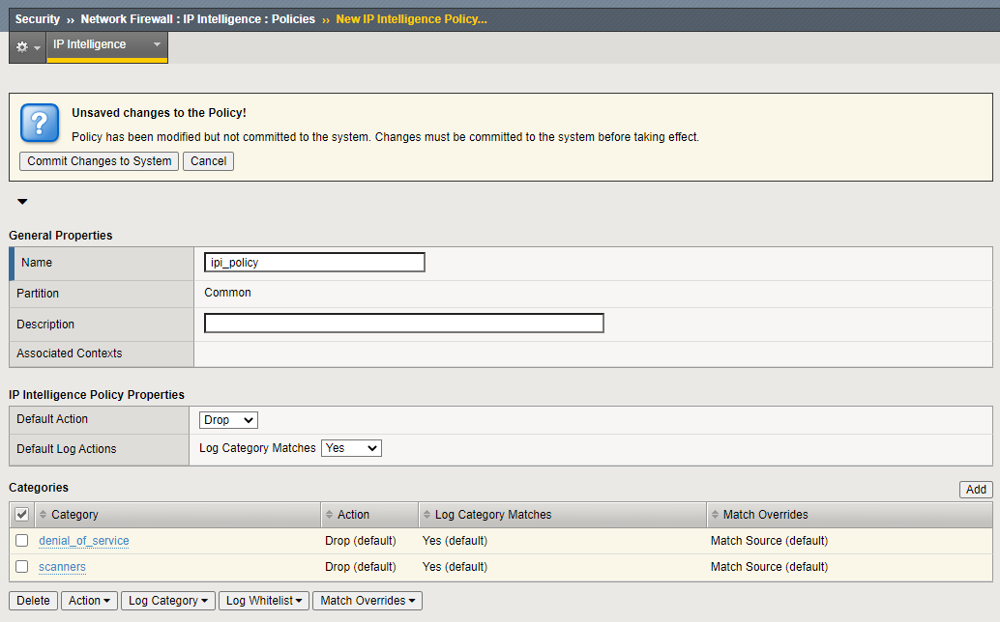

Cuối cùng, bấm vào nút `Commit Changes to System`. 
Bước tiếp theo, áp dụng policy này cho Virtual Server:
Vào `Local Traffic`  ››  `Virtual Servers : Virtual Server List`  ›› chọn virtual server đang cần tác động, ví dụ `vs_https_dvwa` như minh họa bên dưới, chọn Tab `Security` > `Policies`:

Trong mục `IP Intelligence`, chọn `Enabled` và chọn policy mới tạo ở trên

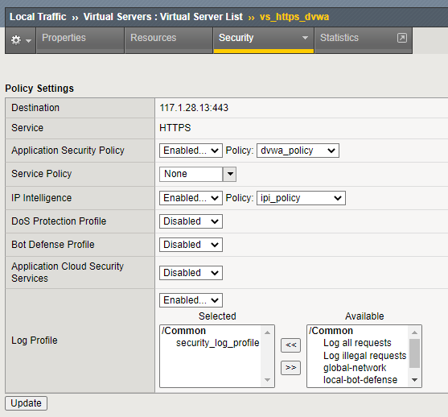

Click vào nút `Update`.

Để xem log các vi phạm này, vào `Security`  ››  `Event Logs : Network : IP Intelligence`

## 4. Thiết lập chế độ chống tấn công dò quét mật khẩu

Một trong những hình thức tấn công tương đối phổ biến vào các ứng dụng web là tấn công dò quét mật khẩu (brute-force attack). Kẻ tấn công biết được username, và sẽ thử nhiều lần với nhiều mật khẩu khác nhau cho đến khi thành công. Ví dụ dưới đây sẽ hướng dẫn cách cấu hình cho một ứng dụng cụ thể, các ứng dụng khác nhau sẽ có cách quản lý đăng nhập khác nhau, tham số khác nhau, cần có phân tích và hiểu biết nhất định trước khi thực hiện. Về cơ bản, các bước cần thực hiện trên hệ thống F5 BIG-IP là:

- Tạo `Login URL`, `Logout URL`
- Cấu hình `Session Tracking`
- Cấu hình `Brute-force attack Prevention`

Để tạo Login URL, cần biết ứng dụng nhận thông tin đăng nhập bằng cách nào:
- Giao thức HTTP hay HTTPS
- URL (ví dụ /login.php)
- Method (ví dụ POST)
- Parameter (ví dụ username, userid, password, pwd..)
- Nhận biết kết quả đăng nhập thành công hay thất bại thông qua response. Ví dụ trả về response code 200 hoặc 403, hoặc trả về 200 kèm theo đoạn text thể hiện thành công hay thất bại, hoặc thông tin nằm trong response header..

Để tạo Login URL, truy cập vào `Security`  ››  `Application Security : Sessions and Logins : Login Pages List`, bấm vào nút `Create` để tạo mới:

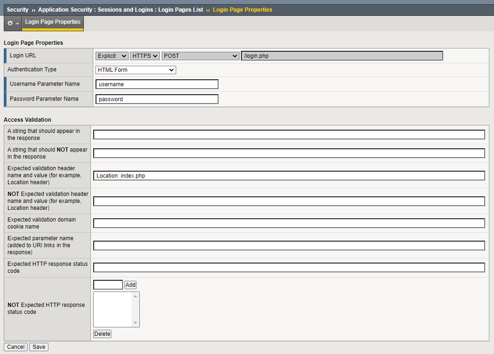

Sau đó bấm vào nút `Save`, tương tự, tạo Logout URL, để hệ thống biết khi nào người dùng Logout và ngừng theo dõi phiên làm việc của user.

Để tạo Logout URL, truy cập vào `Security`  ››  `Application Security : Sessions and Logins : Logout Pages List`, bấm vào nút `Create` để tạo mới:

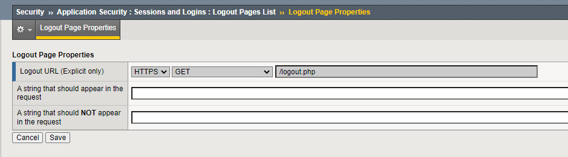

Tiếp theo, bật tính năng theo dõi phiên làm việc của người dùng - `Session Tracking`, vào `Security`  ››  `Application Security : Sessions and Logins : Session Tracking`, bật `Session Awareness` trên `Login URL` vừa tạo:

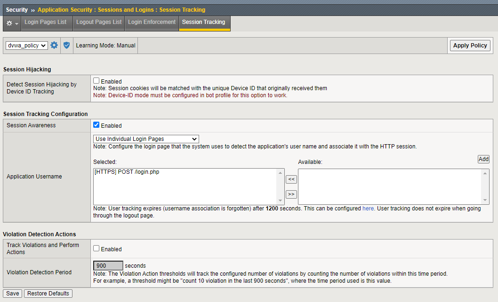

Sau đó bấm `Save` và `Apply Policy`

Vào `Security`  ››  `Application Security : Brute Force Attack Prevention`, bấm nút `Create` để tạo một cấu hình mới:
- Lựa chọn login URL (login page) đã tạo ở bước trước.
- Thiết lập cho cơ chế bảo vệ dựa vào địa chỉ nguồn (Source-based Brute Force Protection)
- Thiết lập cho cơ chế bị tấn công phân tán (Distributed Brute Force Protection)

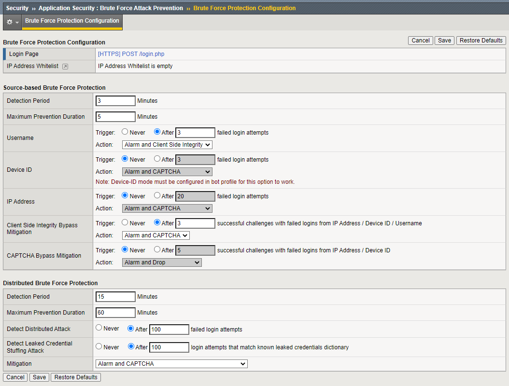

Sau đó bấm `Save` và `Apply Policy`

Vào giao diện command line, gõ các lệnh sau:

```
tmsh modify sys db asm.cs_qualified_urls value "/login.php"
save sys config
```

**Phần dưới đây sẽ là một thử nghiệm tấn công**

Thử đăng nhập vào ứng dụng với tài khoản hợp lệ, đảm bảo rằng việc đăng nhập xảy ra bình thường.

Thử đăng nhập vào ứng dụng với cùng username, nhưng sai mật khẩu, đảm bảo rằng ứng dụng vẫn hoạt động bình thường, có thông báo từ ứng dụng cho người dùng biết răng họ đã đăng nhập sai mật khẩu.

Với các thiết lập ở trên, thử đăng nhập vào ứng dụng sai liên tiếp 4 hoặc 5 lần trong 3 phút. Để ý kỹ, tại lần thứ 5, trình duyệt sẽ có 1 lần refresh do bị kích hoạt cơ chế phòng vệ `client-site integrity`, F5 BIG-IP sẽ gửi javascript tới trình duyệt, yêu cầu nó thực hiện và gửi lại kết quả.

Khảo sát Events Log, ta sẽ nhìn thấy một vi phạm như sau:

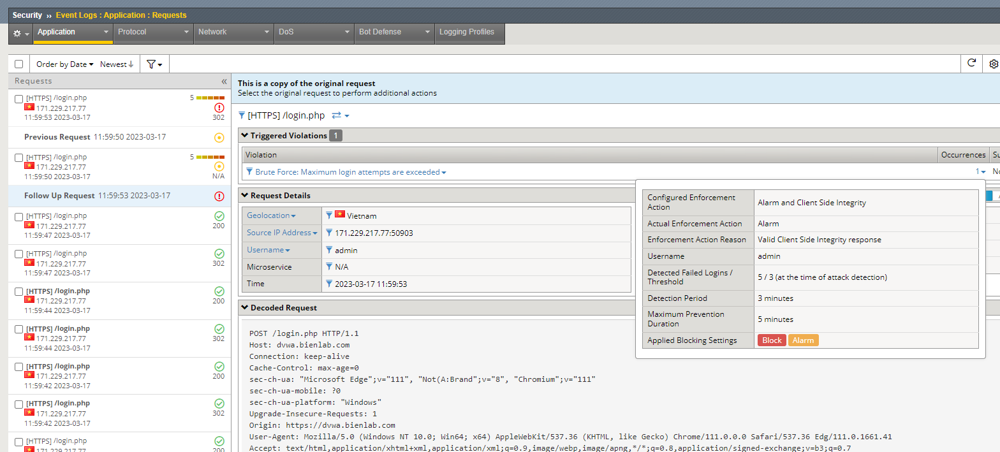

Thông tin trên cho thấy việc đăng nhập sai quá 3 lần đã được ghi nhận, hệ thống đã gửi javascript cho trình duyệt và javascript đó đã thực hiện thành công. Người dùng thực tế không nhận ra sự khác biệt rõ ràng nhưng máy chủ phía sau đã được bảo vệ.

Tuy nhiên, cách thức dò quét như trên là đối với một trình duyệt bình thường, người dùng bình thường. Kẻ tấn công có chủ đích thường viết script, chạy bot để tốc độ dò quét mật khẩu nhanh hơn, dưới đây là một đoạn script rất đơn giản để thử nghiệm:
```
#!/bin/bash

echo "login lan thu 1"
curl 'https://dvwa.bienlab.com/login.php' \
  -H 'Accept: text/html,application/xhtml+xml,application/xml;q=0.9,image/avif,image/webp,image/apng,*/*;q=0.8,application/signed-exchange;v=b3;q=0.7' \
  -H 'Accept-Language: en,en-US;q=0.9,vi;q=0.8' \
  -H 'Cache-Control: max-age=0' \
  -H 'Connection: keep-alive' \
  -H 'Content-Type: application/x-www-form-urlencoded' \
  -H 'Cookie: BIGIPAuthUsernameCookie=admin; f5currenttab="main"; f5mainmenuopenlist=""; f5advanceddisplay=""; security=low; TS019fa5f1030=0; f5_refreshpage="https%3A//dvwa.bienlab.com%3A8443/dms/policy/requests_ng.php"; BIGIPAuthCookie=kXZiWN1Ealng5up2idtyjYncdqw3J8pyMXm1HUSN; PHPSESSID=voonj10j3v6kgml8fbujpb5m47; f5formpage="/tmui/locallb/pool/resources.jsp?name=/Common/dvwa_pool"; TS019fa5f1=01ed81241150ca5c383559014eddb5ef5d6bcbc02d47f468362b4900732ac291511109b1e111b49704f1ceca516e3ef872921f9d3f' \
  -H 'Origin: https://dvwa.bienlab.com' \
  -H 'Referer: https://dvwa.bienlab.com/login.php' \
  -H 'Sec-Fetch-Dest: document' \
  -H 'Sec-Fetch-Mode: navigate' \
  -H 'Sec-Fetch-Site: same-origin' \
  -H 'Sec-Fetch-User: ?1' \
  -H 'Upgrade-Insecure-Requests: 1' \
  -H 'User-Agent: Mozilla/5.0 (Windows NT 10.0; Win64; x64) AppleWebKit/537.36 (KHTML, like Gecko) Chrome/111.0.0.0 Safari/537.36' \
  -H 'sec-ch-ua: "Google Chrome";v="111", "Not(A:Brand";v="8", "Chromium";v="111"' \
  -H 'sec-ch-ua-mobile: ?0' \
  -H 'sec-ch-ua-platform: "Windows"' \
  --data-raw 'username=admin&password=password1&Login=Login&user_token=2b8360ffb89776248f4580e7627873e5' \
  -i

sleep 1

echo "login lan thu 2"
curl 'https://dvwa.bienlab.com/login.php' \
  -H 'Accept: text/html,application/xhtml+xml,application/xml;q=0.9,image/avif,image/webp,image/apng,*/*;q=0.8,application/signed-exchange;v=b3;q=0.7' \
  -H 'Accept-Language: en,en-US;q=0.9,vi;q=0.8' \
  -H 'Cache-Control: max-age=0' \
  -H 'Connection: keep-alive' \
  -H 'Content-Type: application/x-www-form-urlencoded' \
  -H 'Cookie: BIGIPAuthUsernameCookie=admin; f5currenttab="main"; f5mainmenuopenlist=""; f5advanceddisplay=""; security=low; TS019fa5f1030=0; f5_refreshpage="https%3A//dvwa.bienlab.com%3A8443/dms/policy/requests_ng.php"; BIGIPAuthCookie=kXZiWN1Ealng5up2idtyjYncdqw3J8pyMXm1HUSN; PHPSESSID=voonj10j3v6kgml8fbujpb5m47; f5formpage="/tmui/locallb/pool/resources.jsp?name=/Common/dvwa_pool"; TS019fa5f1=01ed81241150ca5c383559014eddb5ef5d6bcbc02d47f468362b4900732ac291511109b1e111b49704f1ceca516e3ef872921f9d3f' \
  -H 'Origin: https://dvwa.bienlab.com' \
  -H 'Referer: https://dvwa.bienlab.com/login.php' \
  -H 'Sec-Fetch-Dest: document' \
  -H 'Sec-Fetch-Mode: navigate' \
  -H 'Sec-Fetch-Site: same-origin' \
  -H 'Sec-Fetch-User: ?1' \
  -H 'Upgrade-Insecure-Requests: 1' \
  -H 'User-Agent: Mozilla/5.0 (Windows NT 10.0; Win64; x64) AppleWebKit/537.36 (KHTML, like Gecko) Chrome/111.0.0.0 Safari/537.36' \
  -H 'sec-ch-ua: "Google Chrome";v="111", "Not(A:Brand";v="8", "Chromium";v="111"' \
  -H 'sec-ch-ua-mobile: ?0' \
  -H 'sec-ch-ua-platform: "Windows"' \
  --data-raw 'username=admin&password=password2&Login=Login&user_token=2b8360ffb89776248f4580e7627873e5' \
  -i

sleep 1

echo "login lan thu 3"
curl 'https://dvwa.bienlab.com/login.php' \
  -H 'Accept: text/html,application/xhtml+xml,application/xml;q=0.9,image/avif,image/webp,image/apng,*/*;q=0.8,application/signed-exchange;v=b3;q=0.7' \
  -H 'Accept-Language: en,en-US;q=0.9,vi;q=0.8' \
  -H 'Cache-Control: max-age=0' \
  -H 'Connection: keep-alive' \
  -H 'Content-Type: application/x-www-form-urlencoded' \
  -H 'Cookie: BIGIPAuthUsernameCookie=admin; f5currenttab="main"; f5mainmenuopenlist=""; f5advanceddisplay=""; security=low; TS019fa5f1030=0; f5_refreshpage="https%3A//dvwa.bienlab.com%3A8443/dms/policy/requests_ng.php"; BIGIPAuthCookie=kXZiWN1Ealng5up2idtyjYncdqw3J8pyMXm1HUSN; PHPSESSID=voonj10j3v6kgml8fbujpb5m47; f5formpage="/tmui/locallb/pool/resources.jsp?name=/Common/dvwa_pool"; TS019fa5f1=01ed81241150ca5c383559014eddb5ef5d6bcbc02d47f468362b4900732ac291511109b1e111b49704f1ceca516e3ef872921f9d3f' \
  -H 'Origin: https://dvwa.bienlab.com' \
  -H 'Referer: https://dvwa.bienlab.com/login.php' \
  -H 'Sec-Fetch-Dest: document' \
  -H 'Sec-Fetch-Mode: navigate' \
  -H 'Sec-Fetch-Site: same-origin' \
  -H 'Sec-Fetch-User: ?1' \
  -H 'Upgrade-Insecure-Requests: 1' \
  -H 'User-Agent: Mozilla/5.0 (Windows NT 10.0; Win64; x64) AppleWebKit/537.36 (KHTML, like Gecko) Chrome/111.0.0.0 Safari/537.36' \
  -H 'sec-ch-ua: "Google Chrome";v="111", "Not(A:Brand";v="8", "Chromium";v="111"' \
  -H 'sec-ch-ua-mobile: ?0' \
  -H 'sec-ch-ua-platform: "Windows"' \
  --data-raw 'username=admin&password=password3&Login=Login&user_token=2b8360ffb89776248f4580e7627873e5' \
  -i

sleep 1

echo "login lan thu 4"
curl 'https://dvwa.bienlab.com/login.php' \
  -H 'Accept: text/html,application/xhtml+xml,application/xml;q=0.9,image/avif,image/webp,image/apng,*/*;q=0.8,application/signed-exchange;v=b3;q=0.7' \
  -H 'Accept-Language: en,en-US;q=0.9,vi;q=0.8' \
  -H 'Cache-Control: max-age=0' \
  -H 'Connection: keep-alive' \
  -H 'Content-Type: application/x-www-form-urlencoded' \
  -H 'Cookie: BIGIPAuthUsernameCookie=admin; f5currenttab="main"; f5mainmenuopenlist=""; f5advanceddisplay=""; security=low; TS019fa5f1030=0; f5_refreshpage="https%3A//dvwa.bienlab.com%3A8443/dms/policy/requests_ng.php"; BIGIPAuthCookie=kXZiWN1Ealng5up2idtyjYncdqw3J8pyMXm1HUSN; PHPSESSID=voonj10j3v6kgml8fbujpb5m47; f5formpage="/tmui/locallb/pool/resources.jsp?name=/Common/dvwa_pool"; TS019fa5f1=01ed81241150ca5c383559014eddb5ef5d6bcbc02d47f468362b4900732ac291511109b1e111b49704f1ceca516e3ef872921f9d3f' \
  -H 'Origin: https://dvwa.bienlab.com' \
  -H 'Referer: https://dvwa.bienlab.com/login.php' \
  -H 'Sec-Fetch-Dest: document' \
  -H 'Sec-Fetch-Mode: navigate' \
  -H 'Sec-Fetch-Site: same-origin' \
  -H 'Sec-Fetch-User: ?1' \
  -H 'Upgrade-Insecure-Requests: 1' \
  -H 'User-Agent: Mozilla/5.0 (Windows NT 10.0; Win64; x64) AppleWebKit/537.36 (KHTML, like Gecko) Chrome/111.0.0.0 Safari/537.36' \
  -H 'sec-ch-ua: "Google Chrome";v="111", "Not(A:Brand";v="8", "Chromium";v="111"' \
  -H 'sec-ch-ua-mobile: ?0' \
  -H 'sec-ch-ua-platform: "Windows"' \
  --data-raw 'username=admin&password=password4&Login=Login&user_token=2b8360ffb89776248f4580e7627873e5' \
  -i
```
Kết quả của script trên đối với 3 lần đầu đều là đã kết nối thành công với ứng dụng:
```
HTTP/1.1 302 Found
Date: Fri, 17 Mar 2023 05:10:57 GMT
Expires: Thu, 19 Nov 1981 08:52:00 GMT
Cache-Control: no-store, no-cache, must-revalidate
Pragma: no-cache
Location: login.php
Content-Length: 0
Keep-Alive: timeout=5, max=100
Connection: Keep-Alive
Content-Type: text/html; charset=UTF-8
Set-Cookie: TS019fa5f1=01ed81241183390baccd3be0bf73ebc284e33a0b890ada820025f4c65fad8a68ada0a492224bc71c668a44484fab0182f61637ab44; Path=/
```

Tuy nhiên tại lần thứ 4, kết quả mã trả về 200 (không phải từ ứng dụng), hệ thống cũng gửi cho client một file binary chứa script khiến một công cụ như `curl` không thể hoàn thành như đối với một trình duyệt bình thường.
```
HTTP/1.1 200 OK
Content-Length: 6313
Pragma: no-cache
Cache-Control: no-cache
Content-Type: text/html
Set-Cookie: TS019fa5f1078=c70512a20b0a810b08f0888080b08dd4b08c011a140a03706870180a20840b28ffffffff0f3059380022230801120a2f6c6f67696e2e7068702999c2d3d3d6f175073801400158006a04504f5354288f0130f2033a260a08757365726e616d65120561646d696e1a012a200128057801a80100e80101f00105f801013a260a0870617373776f726412052a2a2a2a2a1a012a200128097801a80100e80101f00105f801013a230a054c6f67696e12054c6f67696e1a012a200128057801a80100e80101f00105f801013a430a0a757365725f746f6b656e122032623833363066666238393737363234386634353830653736323738373365351a012a200128207801a80100e80101f00105f8010142410a17424947495041757468557365726e616d65436f6f6b69651a122a1000000000000000000000000000000000220561646d696e280132012a380040014802580142350a0c663563757272656e747461621a122a100000000000000000000000000000000022046d61696e280132012a380040014802580142370a1266356d61696e6d656e756f70656e6c6973741a122a10000000000000000000000000000000002200280132012a380040014802580142360a116635616476616e636564646973706c61791a122a10000000000000000000000000000000002200280132012a380040014802580142300a0873656375726974791a122a100000000000000000000000000000000022036c6f77280132012a3800400148025801426f0a0e66355f72656672657368706167651a122a1000000000000000000000000000000000223c68747470732533412f2f647677612e6269656e6c61622e636f6d253341383434332f646d732f706f6c6963792f72657175657374735f6e672e706870280132012a3800400148025801425c0a0f424947495041757468436f6f6b69651a122a100000000000000000000000000000000022286b585a69574e3145616c6e6735757032696474796a596e63647177334a3870794d586d314855534e280132012a380040014802580142480a095048505345535349441a122a1000000000000000000000000000000000221a766f6f6e6a31306a3376366b676d6c386662756a7062356d3437280132012a380040014802580142660a0a6635666f726d706167651a122a100000000000000000000000000000000022372f746d75692f6c6f63616c6c622f706f6f6c2f7265736f75726365732e6a73703f6e616d653d2f436f6d6d6f6e2f647677615f706f6f6c280132012a38004001480258014a122a100000000000008000000000000000000052122a10000000000000000000000000000000005a1c10f42d189aae7c20ff3f2a100413000008002d8af800000000000000621c10f42d189aee7d20ff3f2a100417020008002d8ac0035f60000000006a1c10f42d189aee7d20ff3f2a100417020008002d8ac0035f60000000007a1208001000188080fcff0f20f582f4a80328008001e2eccfa0068a0110647677612e6269656e6c61622e636f6d9001b093aceb96a9a9f017b00102da01216170706c69636174696f6e2f782d7777772d666f726d2d75726c656e636f646564f20102564efa010561646d696e880213980206a00280808020a802b093aceb96a9a9f017c202122a1000000200000000000000000000000000d2020438353630d80201e00200e802c0df03f002bb03f80200800300880300900300980300a00304a80300b2031108001000188080fcff0f20f582f0682800b80300c00300ca03020816d80300e00300e80300880400ca04152f436f6d6d6f6e2f76735f68747470735f64767761d00400e2040508a208106fea040508ef061022f00404f804039205009a0500a00501aa051208041002180338b40140ac02480368047001c00500c80501d00500e80503f00501f80503920608485454502f312e31121c08f0888080b08dd4b08c01100018008001049001e2eccfa006c801002803300151e4e3ba1e1356266d5a132f436f6d6d6f6e2f647677615f706f6c69637903700400006b50618c; Path=/; Max-Age=5;

Warning: Binary output can mess up your terminal. Use "--output -" to tell
Warning: curl to output it to your terminal anyway, or consider "--output
Warning: <FILE>" to save to a file.

```

Ghi nhận trong Events Log có một bản ghi thể hiện rằng việc dò quét mật khẩu đã bị phát hiện, cơ chế phòng vệ `Alarm and Client Side Integrity` cũng được kích hoạt nhưng không có phản ứng nào khác từ client (script trên không được thiết kế và tính đến khả năng này)

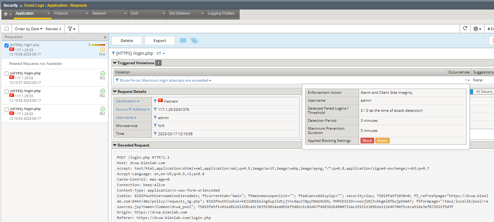

## 5. Cấu hình các chế độ bảo vệ parameter

Các tham số - parameters đối với một ứng dụng web được hiểu là thông tin được người dùng (thông qua trình duyệt) gửi tới ứng dụng bằng một trong các phương thức như POST hoặc GET. Chẳng hạn như đối với tham số về địa chỉ IP trong form dưới đây:

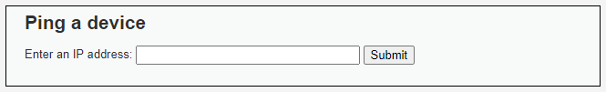

Người sử dụng chỉ nên nhập vào dữ liệu có dạng một địa chỉ IPv4 chẳng hạn, để hạn chế rủi ro bảo mật, người quản trị có thể định nghĩa tham số này (ip) chỉ bao gồm các ký tự dạng số `0-9` và dấu `.`

Làm như vậy sẽ hạn chế được tương đối các khả năng chèn mã độc vào trong tham số này. Để cấu hình khả năng này, người quản trị thực hiện:
- Định nghĩa parameter thủ công nếu đang không bật chế độ học tự động
- Với parameter đó, định nghĩa các loại ký tự được phép/không được phép và các tính năng khác nếu thấy cần thiết

Để định nghĩa thủ công tham số này, truy cập vào `Security`  ››  `Application Security : Parameters : Parameters List`, bấm vào nút `Create` để tạo mới:

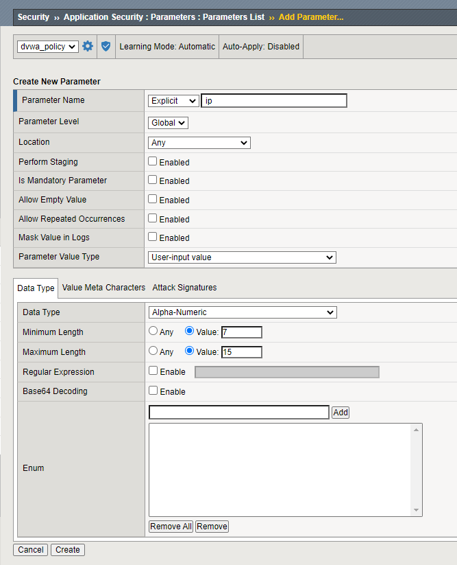

- Parameter Name: đặt tên cho tham số, cái này phải chính xác với ứng dụng thực tế. Sử dụng các tính năng cho developer trên trình duyệt để tìm hiểu tên parameter.
- Perform Staging: có thực thi các thiết lập này ngay lập tức không hay chỉ cảnh báo để tránh nhầm lẫn, sai sót. Ví dụ minh họa là thực hiện ngay (tắt Staging)
- Minimum Length: độ dài tối thiểu của tham số này. Ví dụ với địa chỉ IP, độ dài tối thiểu là 7 (4 chữ số và 3 dấu chấm)
- Maximum Length: độ dài tối đa của tham số này. Ví dụ trong trường hợp này là 15 (4 con số dài 3 chữ số và 3 dấu chấm).

Click vào tab `Value Meta Characters`, thay đổi các ký tự được phép và không được phép đối với dữ liệu của tham số này (chỉ cho phép các con số `0-9` và dấu `.`)

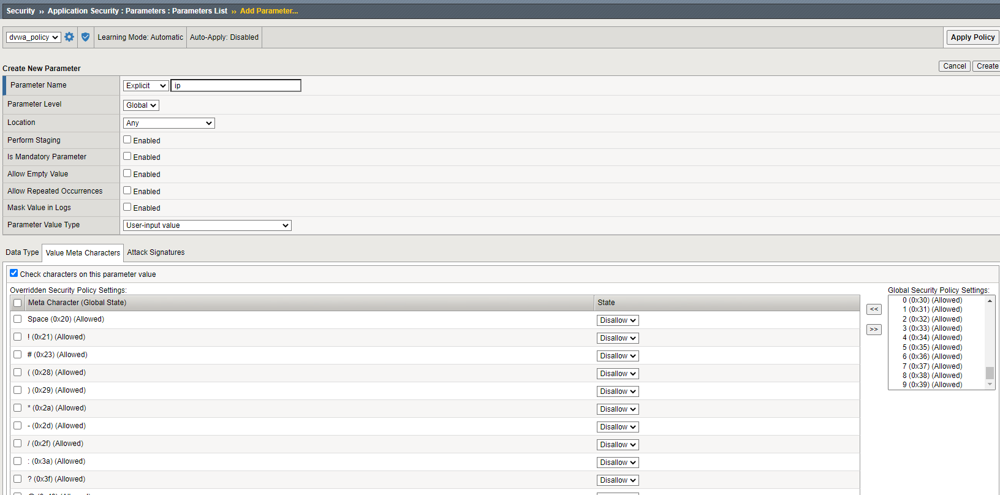

Click nút `Create` và `Apply Policy`

Nếu có vi phạm, trong Events Log cũng sẽ chỉ ra cụ thể đối với tham số này:

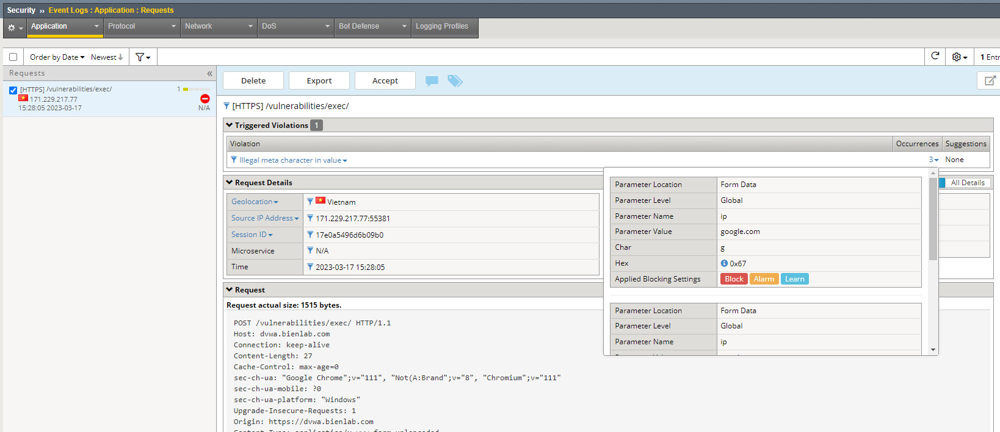

Chiến lược này gọi là Positive Security - chỉ ra các quy tắc hợp lệ để chặn các trường hợp còn lại.

## 6. Tính năng mã hóa dữ liệu trên trình duyệt

Hầu hết các tính năng WAF trong tài liệu này đều thực thi phía F5 BIG-IP, riêng đối với tính năng này là thực hiện tại trình duyệt của người dùng. Theo đó, một đoạn mã javascript sẽ được gửi tới trình duyệt của người dùng nhằm mã hóa các trường thông tin nhạy cảm (username, password..). Việc mã hóa này sẽ tránh được các plug-in độc hại trên trình duyệt đánh cắp các thông tin này.

Ví dụ, một form như dưới đây, khi người dùng nhập dữ liệu xong và chưa bấm vào nút `Login` (chưa submit dữ liệu), hoàn toàn có thể đọc thông tin trong form đó bằng các đoạn mã javascript, chẳng hạn lấy giá trị của password bằng hàm `document.forms[0].password.value` .

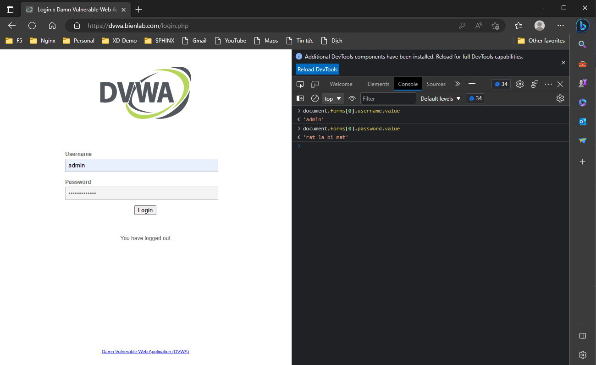

Để mã hóa dữ liệu ngay từ phía trình duyệt (và nhiều tính năng cao cấp khác), cần cấu hình tính năng `DataSafe`.

Trước hết, cần bật module `Fraud Protection Service (FPS)`

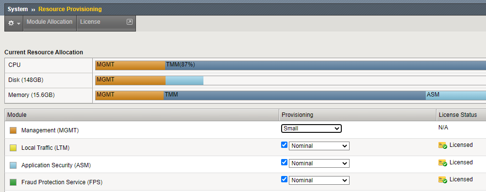

Tạo một local log publisher để có thể xem log liên quan đến tính năng này ngay trên F5 BIG-IP

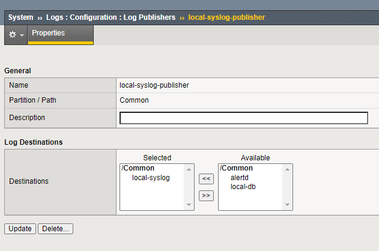

> Khuyến nghị: cấu hình một máy chủ log bên ngoài, và đẩy log phần này ra đó nếu muốn lưu trữ lâu dài.

Truy cập vào `Security`  ››  `Data Protection : BIG-IP DataSafe`, bấm vào nút `Create` 

Đặt tên cho profile, chỉ định Local Syslog Publisher vừa tạo bước trên.

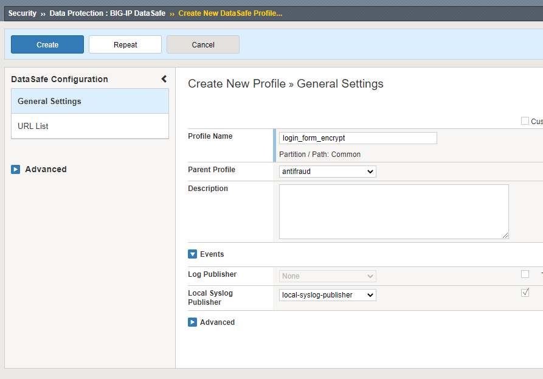

Bấm nút `Create` để tạo profile, sau đó tiếp tục cấu hình các URL, Parameter và tính năng bảo vệ.

Phần `URL List`, bấm nút `Add` để định nghĩa 1 URL cần bảo vệ. URL Path là `/login.php`

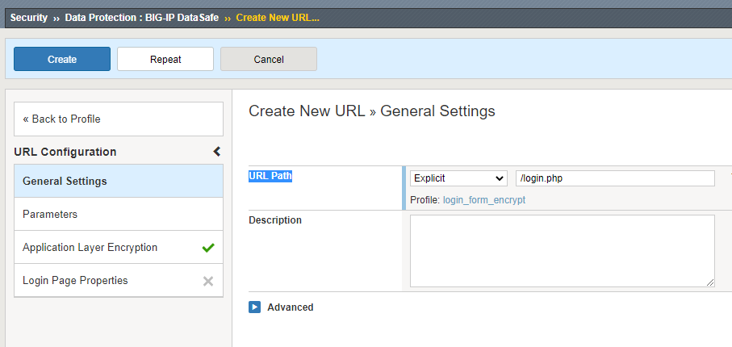

Phần Parameters, thêm vào 2 parameter là `username` và `password` như hình minh họa dưới đây (nhớ chọn mục `Encrypt`):

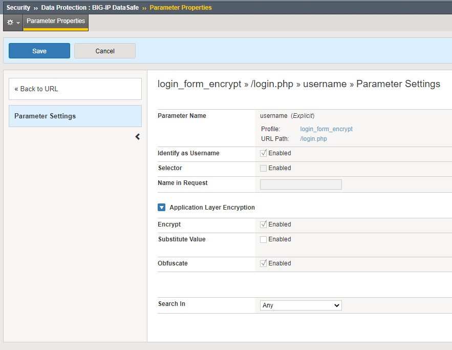

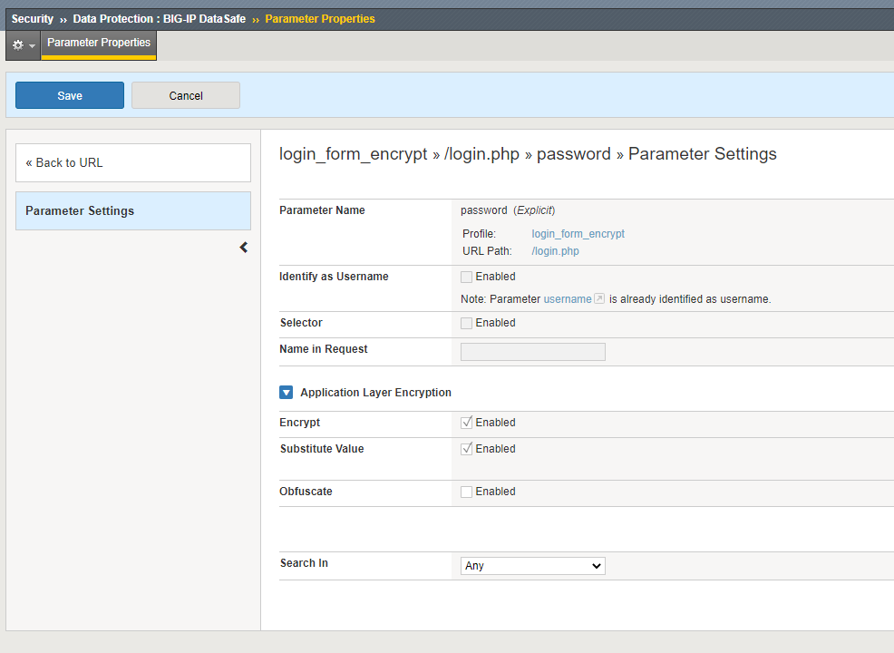

Bấm nút `Save` để lưu lại các parameter đối với URL này và `Back to Profile` để quay ra ngoài màn hình cấu hình profile và bấm vào nút `Save` để lưu lại cấu hình.

Để áp dụng tính năng này cho virtual server, truy cập vào `Local Traffic`  ››  `Virtual Servers : Virtual Server List`  ››  chọn virtual server cần bảo vệ ví dụ `vs_https_dvwa`, trong tab `Security` > `Policies`, phần `DataSafe Profile` chọn `Enabled` và chọn  profile vừa cấu hình như minh họa bên dưới:

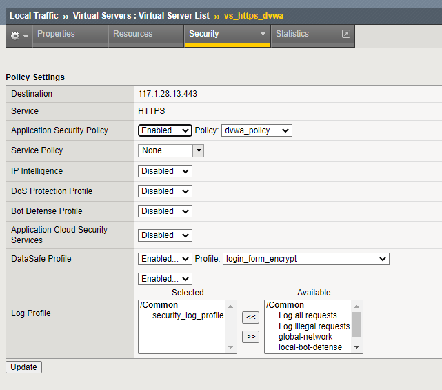

Click vào nút `Update` để lưu lại. Sau đó kiểm tra.

Quay trở lại trình duyệt, thử thực hiện lại hành động đọc thông tin từ trường password (đã được biến đổi thành các chữ `aaaaaaa`):

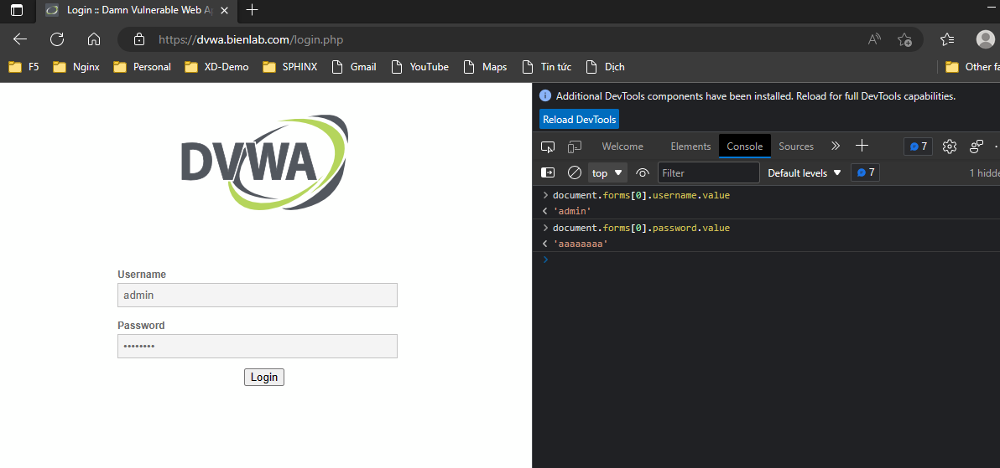

Đặc biệt, khi submit thông tin, trường username được che dấu (obfuscate) và mã hóa (encrypt) như hình minh họa bên dưới:

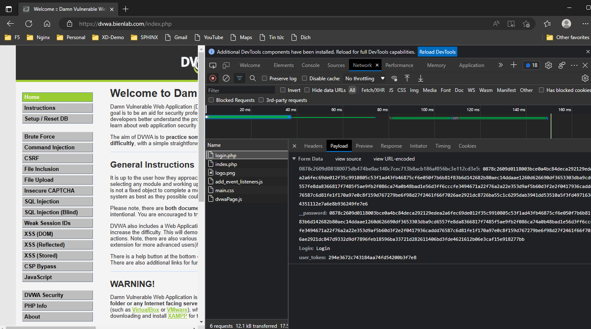

## 7. Sao lưu và phục hồi chính sách bảo mật

Để sao lưu (chính xác là `Export`), vào mục `Security` > `Application Security : Security Policies : Policies List`, chọn policy cần export rồi bấm vào nút `Export` --> `Export Policies`. Hệ thống sẽ cho download về một file có khuôn dạng XML hoặc nhị phân tùy thuộc vào lựa chọn.

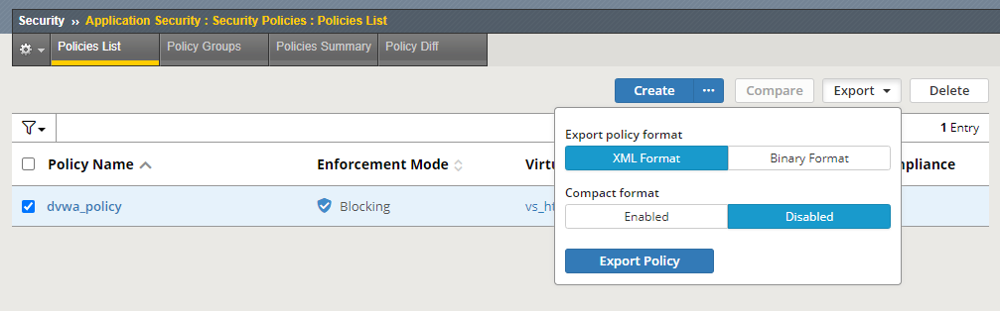

Để phục hồi chính sách bảo mật từ 1 file đã export trước đó, vào 
`Security`  ››  `Application Security : Security Policies : Policies List`, chọn `Import Policy`

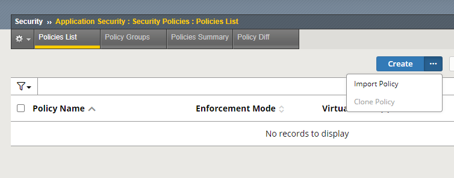

Sau đó vào phần cấu hình virtual server, mục `Security` > `Policies` để áp dụng

